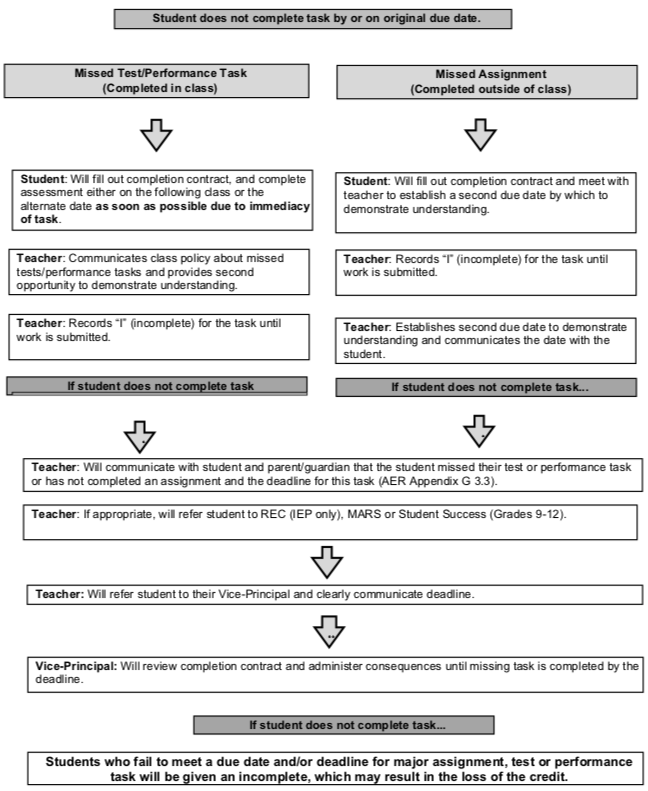

## Grading

### Assignment Submission

All assignments are expected to be submitted by the due date noted in their respective activity pages. You must submit the assignments through the Dropbox (not by email or other means). If you feel that you don't have enough time to finish an activity before its due date, please contact me so we can sort it out.

### Viewing Grades and Feedback

After an assignment is graded, you can view your grade for it on the Grades page along with complementary feedback. I try to grade assignments within 48 hours of their submissions. Sometimes it only takes a few hours; sometimes it may take more than one day.

### Plagiarism and/or Cheating

* Plagiarism of print or Internet material on assessment/evaluation tasks is illegal and therefore, forbidden.
* Submitting assessment tasks copied from another student is forbidden.
* Administration and parent/guardians will be notified of student plagiarism/cheating, and the incident will be recorded.
* The use of computerized translator software is forbidden for foreign languages.
* Inappropriate use of website services is forbidden.

Participating in online courses is a privilege. You are expected to behave in an appropriate manner while logged into your online course(s). Any inappropriate use of language, use of the site facilities for purposes other than course-related activities and malicious actions taken against others through these facilities are not permitted. These violations will be dealt with in a severe manner, and may result in suspension or expulsion from online learning. __Please remember, your actions within the site can and will be monitored. Any communications on the Internet, whether through email, private chat room, or other methods are not private. Be aware that anything you communicate may be viewed by others.__ If you don't want it known, do not type it into your computer.

### WCI Policies - Late and Missing Work

You are registered as WCI students, therefore WCI's policy is in effect regarding late and missed assignments. The policy can be found in the Student/Parent Handbook. It does not matter what policies your home school policies are here is the policy you will be adhering to:

At WCI it is the expectation that students will submit all required work by the assigned due dates as evidence of their learning. Students who fail to meet a due date and/or deadline for assignment, test or performance task may be subject to the Completion Policy flowchart (see below). Failure to submit this work by the deadline, despite these interventions, will be recorded as incomplete and may result in a loss of credit. Lateness is an issue of student responsibility and time management, as well as academic fairness. Students are responsible for providing evidence of their achievement of the overall expectations within a time frame established by teacher. As stated in WRDSB Procedure 1660, marks are not deducted for major assignments (i.e., assignments that comprise part of the critical body of evidence for evaluation and reporting purposes) that are handed in late; rather, instances of lateness can be reflected in the student’s Learning Skills. Major assignments will be clearly communicated by the course teacher.

