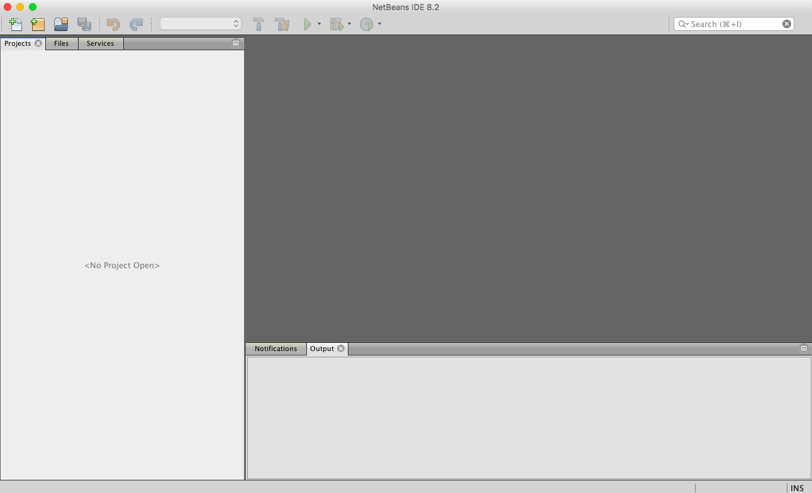

## Downloading Java and NetBeans

You are recommended to use your own computer for this course.

You will need to download JDK 8 (Java Development Kit) and NetBeans 8.2, which is what you will be using to write your code. Some school computers have an old version of NetBeans already installed. You should avoid using an older version since this tends to cause compatibility issues. Also note that JDK 10 (the newest version) is not compatible with NetBeans 8.2, which is why you'll be using JDK 8.

Before you download NetBeans, you need to install Java.

### Installing Java
1. Go to http://www.oracle.com/technetwork/java/javase/downloads/jdk8-downloads-2133151.html.
2. Under Java SE Development Kit 8u181, click on the circle beside Accept License Agreement click the download link that matches your operating system.
  

3. Click on the file in the Downloads folder (or an equivalent of a Downloads folder). Follow the instructions that show up.

### Installing NetBeans
1. Go to https://netbeans.org/downloads/index.html.
2. Make sure that the Platform matches your computer. If it doesn't use the drop-down menu to change it to the correct one.
  

  

3. Press the download button under Java SE. SE stands for "Standard Edition", if you're wondering. 
  

4. You'll be redirected to a page that shows something like this. If the file doesn't download automatically, click on the download it here.
  

5. Click on the file in the Downloads folder (or an equivalent of a Downloads folder). Follow the instructions that show up.
6. Find NetBeans under Programs (or an equivalent of Programs), and open it.
7. If something like this shows up, you have succeeded!
  

