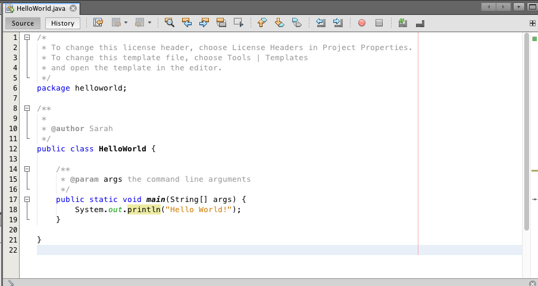
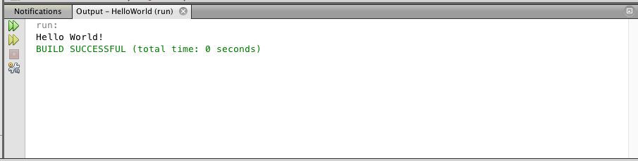
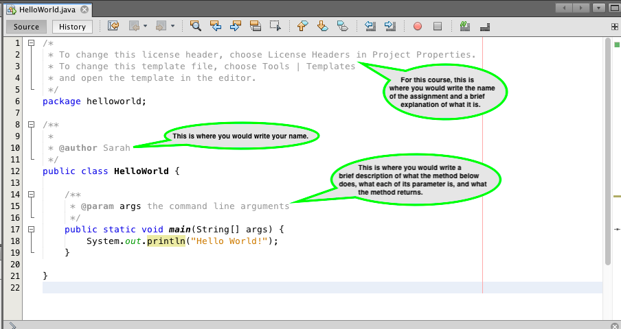
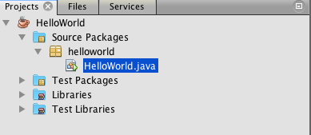
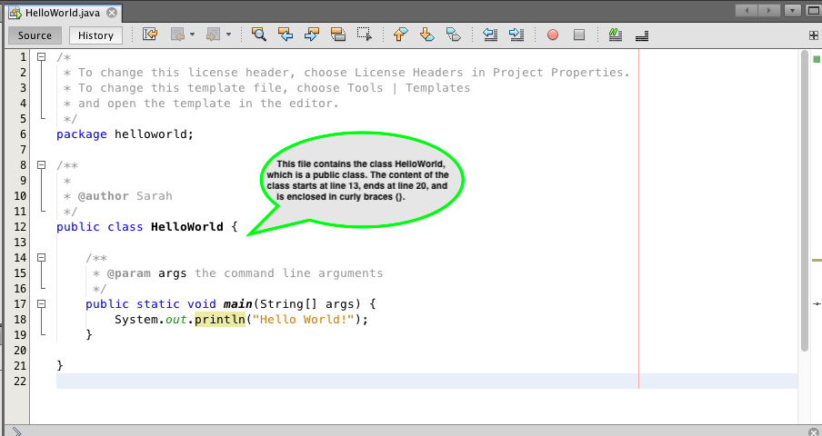
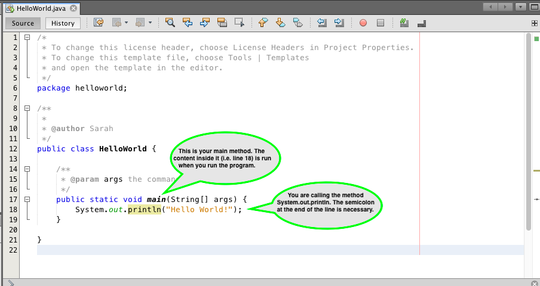

## Lesson

Java is an object-oriented programming language similar to C++ and Turing. Object-oriented programming is a way of writing programs by using a collection of objects working together to perform a task.

NetBeans is the software you are using to write Java code. It's called NetBeans because "java" is another word for coffee, and coffee is made from beans.

### Hello World!

When using a programming language for the first time, it is traditional to run a program that prints "Hello World!".

Let's do it.

> Exercise 2-1
> 
> 1. Open NetBeans and go to **File > New Project**.
> 2. Under Project, click **Java Application**, then click **Next >**.
> 3. Under Project Name, enter "HelloWorld", then click **Finish**.
> 4. Delete `// TODO code application logic here` from line 18 and replace it with `System.out.println("Hello World!");`.
>
> 
> Click F6 or the green triangle near the top of the program.
> 
> If everything went well, something like this should appear in the Output window.
> 

Here's a breakdown of each part of this file.

1. Comments

Comments are used to write words in your program to help explain what is going on. There are two types of comments: single-line and multi-line. The ones you're looking at are all multi-line. In Java, multi-line comments start with `/*` and end with `*/` (the `*` at the beginning of each line in between is optional), and single-line comments start with `//`.

2. Packages

A package is a collection of Java files. You can think of it as a file folder with one or more Java files in it.

A package name typically starts with a lowercase letter. If there is a file that is contained in a package that has no name, it is placed in an automatically-created package known as the *unnamed package*.

You can view your packages on the left side of the screen.

3. Classes

A class is a blueprint for an object. Every Java file should contain exactly one top-level class. A top-level class is a class that is not nested within another class.

Rules for class names:
* The first character is an upper case letter. The name cannot begin with a number.
* If there is more than one word, every word begins with a capital (e.g. HelloWorld).
* There are only letters and numbers. There are no underscores or other special symbols.

A class should be one of the following: `public`, `private`, or `protected`. If none of these are specified, the class becomes package-private. We'll get to what each of those mean later in this course.

4. Methods

You would have learned about functions in your Grade 11 computer science course. Functions in Java are called methods. A method is a function contained in a class. Since every function in Java is contained in a class, every function in Java is a method.

When defining a method, you would write the following, in order:
1. `public`, `private`, or `protected` (or leave it blank for package-private)
2. `static` (or leave it blank if it's non-static)
3. the return type (e.g. `int`, `String`, etc.) (or write `void` if the method doesn't return anything)
4. the name of the method
5. the parameters of the method enclosed in parentheses
6. a left curly brace `{`
7. the content of the method
8. a right curly brace `}`

At least one class in a package should contain a `main` method. The content of a `main` method is run when you run your program. In Java, the main method must be `public`, `static`, and return a `void` value. The `main` method has the parameter `String[] args` (we'll get to what this means later).

There is one more method in this example: `System.out.println`. This is a built-in method that takes whatever is in the parentheses and prints it (followed by a line separator) to the output window. In this example, you are calling the method (i.e. telling it to run). All methods that are being called belong inside another method, such as the `main` method. All methods that are being defined belong outside the `main` method.

5. Strings

`String` is one of the data types in Java. A strings is a sequence of characters (e.g. letters, numbers, symbols, etc.) enclosed in double quotation marks `"` (single quotation marks `'` won't work). In this example, you have the string `"Hello World!"` on line 18.
