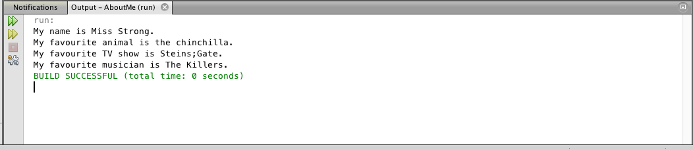

## Assignment: About Me

Complete the following assignment and submit your work to the About Me Dropbox.

In this assignment, you will write learn more about strings and classes.

### Instructions
1. Go to File > New Project. Name the project AboutMe.
2. Write `Assignment 1 - About Me` as a comment at the top of the file. 
3. Modify the strings to include your information, but do not change anything else on the lines. Place these lines of code in the appropriate place in the file.
```java 
public static String name = "<Insert Your Name>";
public static String animal = "<Insert Your Favourite Animal>";
public static String tvShow = "<Insert Your Favourite TV Show>";
public static String musician = "<Insert Your Favourite Musician>";
```
4. Place the following lines of code in the appropriate place in the file.
```java 
System.out.println("My name is _.".replace("_", name));
System.out.println("My favourite animal is _.".replace("_", animal));
System.out.println("My favourite TV show is _.".replace("_", tvShow));
System.out.println("My favourite musician is _.".replace("_", musician));
```
5. When you run the program, the output window should look something like this:

6. When the program works, go to **File > Export Project > To ZIP**. Name the file Assignment 1 - <insert your name here>.zip.
7. Submit both the .zip file and .java file separately to the Dropbox.
