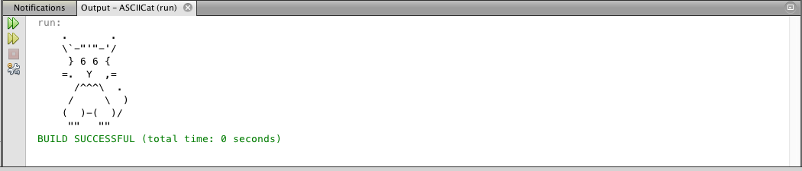

## Bonus Assignment: ASCII Cat

Once you have completed the About Me assignment, you may try the following bonus assignment.

Submit your work to the ASCII Cat Dropbox.

In this assignment, you will write code that prints this cat to the output window. This is an example of ASCII art. 




### Instructions

1. Go to File > New Project. Name the project ASCIICat.

2. Write `Bonus Assignment 1 - ASCII Cat` as a comment at the top of the file. 

3. Determine how to use `System.out.println()` in order to get this cat to print to the output window. 

4. Zip the file and name it **Bonus Assignment 1 - \<insert your name here>.zip**.

5. Submit both the .zip file and .java file separately to the Dropbox.
  

Why is this a Bonus Assignment, you ask? The " and \ symbols in the image cause complications that you'll have to figure out.


For convenience, here are the characters used in the cat.
```
.        .
\'-"'"-'/
 } 6 6 {
 =. Y  ,=
  /^^^\ .
 /     \ ) 
 ( )-( )/ 
  "" ""
  ```
