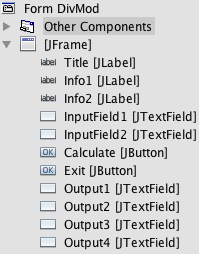

## Lesson: GUIs 

A **Graphical User Interface** (GUI, pronounced "gooey") is a way of interacting with a computer. Examples of GUIs include windows, icons, and menus. 

You will be learning how to create a GUI using Java.

> Exercise 3-3: Part 1  
>    
> 1. Open NetBeans and go to **File > New Project**.    
> 2. Under **Project**, click **Java Application**, then click **Next >**.    
> 3. Under **Project Name**, enter "DivMod". Uncheck the box beside **Create Main Class**, then click **Finish**.    
> 4. On the left side of the screen, right click on **DivMod**, hover over **New**, then click on **JFrame Form**.    
> 5. Under **Class Name**, type in "DivMod". Under **Package**, type in "divmod". Click **Finish**.    
> 6. Your screen should now look something like this.
> 

A GUI builder screen has four major areas:
* **The Design Area** (in the center of the screen) is the main window for creating your GUI forms. A basic form will already be created for you when you start a new project. If you choose to resize the form, it can be done here. You can also use the Source and Design buttons in the top left corner of the Design Area to switch between the graphical view of your program and the code that runs it.
* The **Navigator** (at the bottom-left of the screen) gives a list of all the components that you have added to your application. It will indicate for you what component you are working on, as well as allow you the ability to organize your components and make adjustments to them.
* The **Palette** (at the top-right of the screen) allows you to see a list of components that you can add to your application. To add a component to your application, you simply drag it from here onto your form in the Design Area.
* The **Properties Window** (at the center-right of the screen) will show a list of all the properties of the component in your application that you currently have selected.
 
> Exercise 3-3: Part 2 
>    
> You will be designing a GUI that looks like this:   
>     
> There are three kinds of Swing Controls used in this GUI: Label, Text Field, and Button.    
>     
> Labels: "Two Types of Division" & "Enter an integer" & "Enter another integer"    
> 1. Drag three Labels onto the Design window.    
> 2. Double click on each box to change the text.    
> 3. Adjust the fonts and the colours in the Properties window. 
>    
> Text Fields    
> 1. Drag six Text Field boxes onto the Design window.    
> 2. Delete the text.    
> 3. Resize each box by dragging its sides until it is 80 pixels wide. 
>    
> Button: "Calculate" & "Exit"    
> 1. Drag two Button boxes onto the Design window.    
> 2. Change the text. 
>    
> You should now have an application window that looks like the image above.     
> The next step is to create meaningful variable names for each of the components. In the Navigator, right click on each component and select **Change Variable Name**. Rename all the components according to the images below.    
>    
> Before    
> 
>    
> After   
> 

> Exercise 3-3: Part 3  
>    
> Now that you have created an application with a variety of components, you will need to make it do something.    
> Components are event-driven. That means they do things when certain events take place. For example, when the user presses a button with their mouse (the event), the program displays the solutions.    
>    
> 1. Right-click on the **Calculate** button. Go to **Events**, **Action**, then **actionPerformed**. This will create an **actionListener** for the **Calculate** button. This means that the program will be "listening" for the **actionPerformed** event to occur, and if it does, it will run the set of instructions that you give it within that event. The **actionPerformed** event "listens" for the button to be pressed by either the mouse or the keyboard.    
> 2. Find the `CalculateActionPerformed` method and replace the `TODO` line with the following:    
```java
String text1, text2; 
int int1, int2; 
// Takes the input from the TextBoxes and place them in a variable
text1 = InputField1.getText(); 
text2 = InputField2.getText(); 
// Takes the input values (in String format) and convert them into Integers to use in the program
int1 = Integer.parseInt(text1);
int2 = Integer.parseInt(text2); 
// Outputs the values to the TextBoxes you defined
Output1.setText(int1 + "/" + int2 + "=" + int1/int2);
Output2.setText(int1 + "%" + int2 + "=" + int1%int2);
Output3.setText(int2 + "/" + int1 + "=" + int2/int1);
Output4.setText(int2 + "%" + int1 + "=" + int2%int1);
```
> Now create an event for the **Exit** button. Right click on the **Exit** button, select **Event**, **Action**, **actionPerformed**. Replace the `TODO` line with the following.    
```java
System.exit(0);
```
> You have now created a program that has a GUI. When you run the program, a new window should pop up where you can play with the GUI.  
>     
> Although you don't need to know the background code that runs the GUI, you will need to understand the code that the program uses to define the output. Read through the line comments to understand what each line of code does.
>     
> If your program did not work correctly, the DivMod program can be found [here](../Java_Programs/DivMod.zip).    
