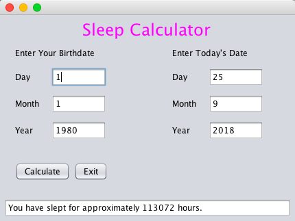

## Assignment: Sleep Calculator

Complete the following assignment and submit your work to the Sleep Calculator Dropbox.

In this assignment, you will create a Sleep Calculator application that estimates the number of hours a person has spent sleeping from the time they was born.

### Instructions

1. Create a GUI that estimates the number of hours a person has slept from the time they were born. You may use the following assumptions to simplify the calculation.
  * everyone sleeps 8 hours every night
  * there are 30 days in each month
  * there are 365 days in each year
  
  Here is an example of what your GUI may look like.
  
  

2. Run the program and test it out to ensure that it works as expected.

3. When the program works, go to File > Export Project > To ZIP. Name the file Assignment 3 - <insert your name here>.zip.

4. Submit the following to the Dropbox.
  * A .zip file of the program
  * A .txt file that contains the Java code. You can do this by copy-pasting your code into a text editor, such as Notepad or Sublime.
  * A self-evaluation using the rubric below. 

### Rubric

The following rubric (which is the same as the one for the Change assignment) will be used to evaluate your assignment. Each row counts for 4 points, for a total of 32 points. 

You can download the rubric [here](https://docs.google.com/document/d/1hYyz4BkeOiyYs38s4WxF1nQHXgA2AQuGgNnQGHRtroI/edit?usp=sharing).

| Category | Level 4 | Level 3 | Level 2 | Level 1 | Below Level 1 |
| --- | --- | --- | --- | --- | --- |
| Knowledge and Understanding 1 | I demonstrated more than the expected amount of knowledge about creating GUIs. | I demonstrated the expected amount of knowledge about creating GUIs. | I demonstrated slightly less than the expected amount of knowledge about creating GUIs. | I demonstrated a small amount of knowledge  about creating GUIs. | I demonstrated no knowledge about creating GUIs. |
| Knowledge and Understanding 2 |  I demonstrated more than the expected amount of knowledge about mathematical operators in Java. | I demonstrated the expected amount of knowledge about mathematical operators in Java. | I demonstrated slightly less than the expected amount of knowledge about mathematical operators in Java. | I demonstrated a small amount of knowledge  about mathematical operators in Java. | I demonstrated no knowledge about mathematical operators. |
| Thinking 1 | I put more than the expected amount of thought and consideration into testing my program. | I put the expected amount of thought and consideration into testing my program. | I put slightly less than the expected amount of thought and consideration into testing my program. | I put a small amount of thought and consideration into testing my program. | I put no thought and consideration into the testing my program. |
| Thinking 2 | I put more than the expected amount of thought and consideration into my solution. |I put the expected amount of thought and consideration into my solution. |I put slightly less than the expected amount of thought and consideration into my solution. | I put a small amount of thought and consideration into my solution. | I put no thought and consideration into my solution. |
| Application 1 | I followed all the instructions and there is a WOW factor. | I followed all the instructions but there is no WOW factor. | I followed most of the instructions. | I followed some of the instructions. | I followed none of the instructions. |
| Application 2 |  The user-friendliness of my GUI was beyond the expected quality. | The user-friendliness of my GUI met the expected quality. | The user-friendliness of my GUI didn't quite meet the expected quality. | The user-friendliness of my GUI was far below the expected quality. | My GUI was not user-friendly at all. |
| Communication 1 | The readability of my code (e.g. appropriate variable names and line comments) was beyond the expected quality. | The readability of my code (e.g. appropriate variable names and line comments) met the expected quality. | The readability of my code (e.g. appropriate variable names and line comments) didn't quite meet the expected quality. | The readability of my code (e.g. appropriate variable names and line comments) were far below the expected quality. | My code was not readable at all. |
| Communication 2 |  The tidiness of my code (e.g. consistent spacing and indenting) was beyond the expected quality. | The tidiness of my code (e.g. consistent spacing and indenting) met the expected quality. | The tidiness of my code (e.g. consistent spacing and indenting) didn't quite meet the expected quality. | The tidiness of my code (e.g. consistent spacing and indenting) were far below the expected quality. | My code was not tidy at all. |
