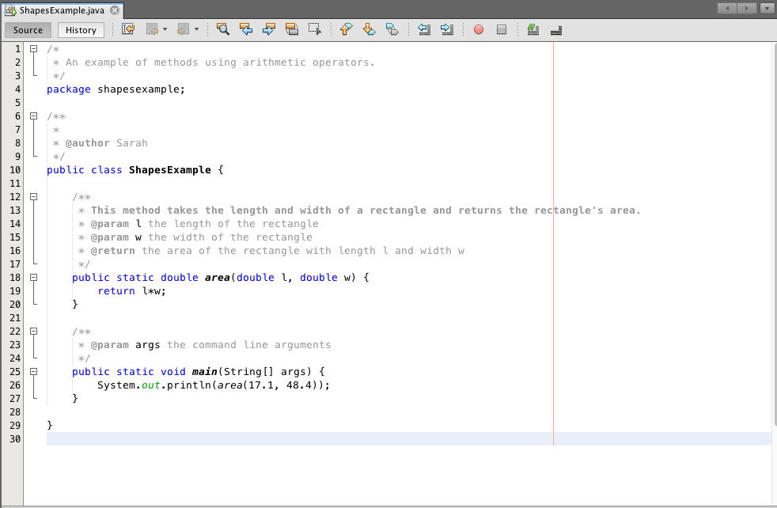
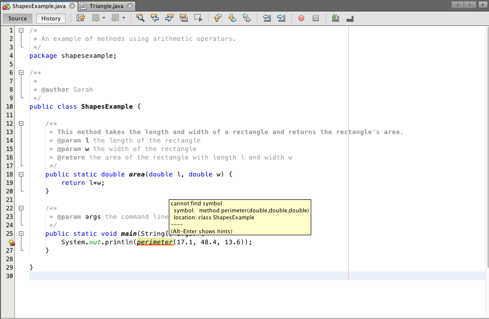

## Lesson:  Methods

### Review
The following content was in Lesson -- Getting Started With Java And NetBeans.

> You would have learned about functions in your Grade 11 computer science course. Functions in Java are called methods. A method is a function contained in a class. Since every function in Java is contained in a class, every function in Java is a method.    
>    
> When defining a method, you would write the following, in order.    
> 1. `public`, `private`, or `protected` (or leave it blank for package-private)    
> 2. `static` (or leave it blank if it's non-static)    
> 3. the return type (e.g. `int`, `String`, etc.) (or write `void` if the method doesn't return anything)    
> 4. the name of the method    
> 5. the parameters of the method enclosed in parentheses    
> 6. a left curly brace `{`    
> 7. the content of the method    
> 8. a right curly brace `}`    
> At least one class in a package should contain a `main` method. The content of a main method is run when you run your program. In Java, the main method must be `public`, `static`, and return a `void` value. The `main` method has the parameter `String[] args` (we'll get to what this means later).    
>    
> `System.out.println` is a built-in method that takes whatever is in the parentheses and prints it (followed by a line separator) to the output window. In this example, you are calling the method (i.e. telling it to run). All methods that are being called belong inside another method, such as the `main` method. All methods that are being defined belong outside the main method.    

Let's review functions in a bit more detail. Many of you have already taken, or are currently taking, the Grade 11 math course *Functions* (MCR3U) or *Functions and Applications* (MCF3M).

In math, a relation is a relationship involving one or more variables. A function is a relation in which each independent variable value has only one corresponding dependent variable value.

For example, *f(x) = x<sup>2</sup> + 4* is a function, in which:
* *f* is the name of the function
* *f(x)* is the dependent variable
* *x* is the independent variable
* *x<sup>2</sup> + 4* is how to compute the value of the dependent variable given the value for the independent variable.

Functions can have more than one independent variable. For example, *f(x, y, z) = 4x + 2y - 1/z* is also a function.

Functions in computer science may look different to functions in math, but they are fundamentally similar.


| . | Math Example | Java Example |
| --- | --- | --- |
| Function | f(x, y, z) = 4x + 2y - 1/z | `public static double foo(double x, double y, double z) {`<br></br>&nbsp;&nbsp;&nbsp;&nbsp;`return 4*x + 2*y - 1.0/z;`<br></br>`}` |
| Function name | *f* | `foo` |
| Parameters (Independent Variables) | *x*, *y*, *z* | `x`, `y`, `z` |
| Return Value (Value of Dependent Variable) | *4x + 2y - 1/z* | `4*x + 2*y - 1.0/z` |
| Other Information | | `public static`: The method is accessible throughout the entire program. <br></br>`double` (before `foo`): The method returns a double.<br></br> `double` (before `x`, `y`, and `z`): The parameters `x`, `y`, and `z` are double values.
| Example | *f(7, -3, 1) = 4(7) + 2(-3) - 1/1 = 28 - 6 - 1 = 21* | `double a = foo(7, -3, 1)`<br></br>`// the value of a is initialized to 21.0` |

In math, *f*, *g*, and *h* are generic names for functions. In computer science, `foo`, `bar`, and `baz` are generic names for functions. You can also come up with your own dummy names for functions that aren't supposed to be meaningful. I'm quite fond of `bloop`.

In computer science, **parameters** are the variable names used in a method. **Arguments** are the values of the parameters you use when you are calling a method. In the example at the bottom of the previous table, the parameters are x, y, and z, and the arguments are 7, -3, and 1.

 
Let's look at one more comparison. 

| Math Example | Java Example |
| --- | --- | 
| *g(x, y) = ax<sup>2</sup> - by* | `public static double bloop(double x, double y) {`<br></br>&nbsp;&nbsp;&nbsp;&nbsp;`return a*x*x - b*y;`<br></br>`}` |

The *a* and *b* that appear here are are not independent variables, otherwise they would be in the parentheses.

In computer science, they are variables or constants that have been previously declared and have had values assigned to them. In math, they make the function represents a collection (i.e. family) of similar functions rather than just one specific function. Note that *f(x) = ax + b* and *g(a, b, x) = ax + b* are two completely different functions; one is a family of linear functions and the other is a four-dimensional function.

Let's create a custom method. 

> Exercise 4-1 Part 1    
>    
> Create a new project and write the following method inside of the class and outside of main.
```java
public static double area(double l, double w) {
    return l*w;
}
```
> Under `main`, write the following using two intefer values of your choice.
```java
System.out.println(area(<insert an int value>, <insert another int value>));
```
> Run the program and see what gets printed. It should be the value of `l` multiplied by `w`.


### Documenting Methods

You may have been wondering what these default lines of code in NetBeans are for:

```java
/**
 * @param args the command line arguments
 */
```

This is the documentation for the `main` method, which is placed directly above the first line of the `main` method. It tells the user that `main` is a method that has one parameter, called `args`, and it represents the command line arguments. 

When we create our own methods, we should document them, too.

Let's add the documentation for the custom method you just used.  

> Exercise 4-1 Part 2    
>   
> Add following documentation directly above the custom method. 
```java
/**
 * This method takes the length and width of a rectangle and returns the rectangle's area.
 * @param l the length of the rectangle
 * @param w the width of the rectangle
 * @return the area of the rectangle with length l and width w
 */
``` 
> Now, your file should look something like this
>    
> 

When you are documenting a method, the following information should be stated:
* A brief description of what the method is for.
* The parameter names and what conditions they have (e.g. can be any integer, must be an integer greater than 2, etc.).
* What the method returns, unless nothing is returned.
* Any side effects of the method (e.g. static variables changing values, information printed to the output window, etc.).
 
> Exercise 4-2
>    
> Let's do one more example.  
>    
> This time, our program will consist of two classes.
> Within the same project, open a new file and call it Triangle. Copy-paste the following into the new class.
```java
/**
 * This method takes the side lengths of a triangle and returns the triangle's perimeter.
 * @param a the first side length of the triangle
 * @param b the second side length of the triangle
 * @param c the third side length of the triangle
 * @return the perimeter of the triangle with side lengths a, b, and c
 */ 
public static double perimeter(double a, double b, double c) {
    return a + b + c;
}
```    
> Now, let's try to use this custom method.    
> Go back to your first file. Under `main`, replace your first custom method with your newest custom method. There should now be a red squiggly line underneath it. Hover over it to see what the issue is.        
> Here is what mine looks like:
>    
>     
>  The issue is that the Java compiler can't find the newest custom method since it's not in the same class as `main`. You have to tell it what class it is in. To do this, put the class name in front of the method, separated by a dot.     
> Replace `perimeter` with `Triangle.perimeter` and run the program again. It should now print 79.1, which is the sum of 17.1, 48.4, and 13.6. 

If you don't want a method to be called from a class other than the one it is in, you can use the modifier `private` instead of `public` when you're defining the method.


### Using Built-In Methods

The following content was in Lesson -- Data Types.
> The [Java Application Program Interface](https://docs.oracle.com/javase/7/docs/api/) (API) is a collection of prewritten packages, classes, and interfaces. You can use it to find out what packages, classes, and interfaces exist and how you can use them when you are writing code in Java. 
>     
> For example, under **All Classes**, you can find **Math**. Under **Methods Summary**, you can see all its built-in methods. One of the methods is **pow(double a, double b)**. This tells that if you want to evaluate 2<sup>3</sup>, you would use `Math.pow(2, 3)`. (This is an example of coercion, since 2 and 3 are actually integers, not doubles.)

  
Let's look at some more of the built-in methods in `Math`.
* `Math.max` compares two values and returns the largest value.
* `Math.pow` computes and returns the first value to the power of the second value.
* `Math.random` returns a pseudo-random number that is greater than zero and less than one.
* `Math.round` rounds a value up or down to the nearest integer and returns the value.
* `Math.sqrt` computes and returns the square root of a specific number.
* `Math.abs` finds the absolute value of a number.
* `Math.ceil` computes and returns the smallest integer greater than, or equal to, the number.
* `Math.floor` computes and returns the largest integer less than, or equal to, the number.
* `Math.min` compares two numbers and returns the smallest.

Just like when you created a custom method and called it from a different file, the class name goes before the method name and is separated by a dot.
