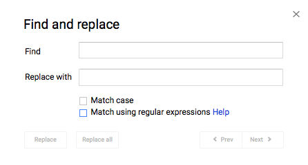

## Strings

### Special Characters

Strings are made up of characters, which are typically letters, numbers, and spaces. There are also special characters, such as tabspace and newline that can appear in strings.

Special characters begin with a backslash `\`.

| Special Character | Code |
| --- | --- |
| tabspace | `\t` |
| backspace | `\b` |
| carriage return (i.e. enter or return) | `\r` |
| newline | `\n` |

Here is an example of how you can use a special character.
```java
// Prints "This is Line 1" on the one line, then "This is Line 2" on the next line
System.out.println("This is Line1\nThis is Line 2");
```

However, ``println()`` is designed to print one line at a time, so it is preferable to do the following instead.
```java
System.out.println("This is Line 1");
System.out.println("This is Line 2");
```

The backslash is called an **escape character**, since it "escapes" the next character.

You can also use the escape character to create strings that contain double quotation marks and characters that contain a single quotation mark.

```java
System.out.println("\""); // Prints a double quotation mark
System.out.println("\"\""); // Prints two double quotation marks
System.out.println('\''); // Prints a single quotation mark
```

To create a string with a backslash, you put an escape character in front of it.

```java
System.out.println("\\"); // Prints a backslash
```


### Strings and Loops

Suppose you want to check whether a string contains a particular character.

You can iterate through a string character by character using something like this:

```java
String word;
/* Initialize word here */

for (int i = 0; i < word.length(); i++) {
    /* Do something with word.charAt(i), which is the character at index i */
}
```

N.B.: You can't use `word[i]` to access the character at index `i` in Java, although other programming languages allow this. 

For example, if you wanted to check whether the sentence "The quick brown fox jumps over the lazy dog" contains the letter "v", you can do the following:

```java
String sentence = "The quick brown fox jumps over the lazy dog";
boolean sentenceHasV = false;

for (int i = 0; i < sentence.length(); i++) {
    if (sentence.charAt(i) == 'v') sentenceHasV = true;
}
```

Now, suppose you want to check whether a specific sentence has a word that starts with the letter 'j'. You could modify the example above, but a cleaner way would be to split the string into an array of strings.

```java
String sentence = "The quick brown fox jumps over the lazy dog";
boolean sentenceHasJWord = false;

String[] words = sentence.split("\\s+");

for (String word : words) {
    if (word.startsWith("j") sentenceHasJWord = true;
}
```

The `split()` method in the `String` class splits a string based on a pattern and puts the individual parts into an array. The pattern `"\\s+"` represents all whitespace (e.g. space, tab, etc.), so the new array `words` is `{"The", "quick", "brown", "fox", "jumps", "over", "the", "lazy", "dog"}`.

There are several methods in the `String` class that are useful for analyzing the characters that are in it.

N.B.: Always assume that strings are case-sensitive when using any programming language.

| Method | Example | Description |
| --- | --- | --- |
| `equals()` | `"monkey".equals("Monkey"); // false` | Checks whether `"monkey"` and `"Monkey"` have the same content. |
| `equalsIgnoreCase()` | `"monkey".equalsIgnoreCase("Monkey"); // true` | Checks whether `"monkey"` and `"Monkey"` have the same content, ignoring any differences in capitalization. |
| `startsWith()` | `"monkey".startsWith("mo"); // true` | Checks whether `"monkey"` begins with `"mo"`. |
| `endWith()` | `"monkey".endsWith("oy"); // false` | Checks whether `"monkey"` ends with `"oy"`. |
| `contains()` | `"monkey".contains("onk"); // true` | Checks whether `"monkey"` contains `"onk"`. |


There are also several methods in the `String` class that are useful for modifying strings.

| Method | Example | Description |
| --- | --- | --- |
| `trim()` |  `"  monkey    ".trim(); // "monkey"` | Removes all whitespace at the beginning and end of the string. |
| `substring()` | `"monkey".substring(2); // "nkey"<br></br>"monkey".substring(1, 3); // "on"` | Removes the first two characters.<br></br>Keeps only the characters between index 1 (inclusive) and 3 (exclusive). |
| `toUpperCase()` | `"Monkey".toUpperCase(); // "MONKEY"` | Changes all lower case letters to be upper case letter. |
| `toLowerCase()` | `"Monkey".toLowerCase(); // "monkey"` | Changes all upper case letters to be lower case letter. |
| `toCharArray()` | `"monkey".toCharArray(); // {'m', 'o', 'n', 'k', 'e', 'y'}` | Creates a character array of the characters in the string. |
| `replace()` | `"abcabc".replace("a", "ef"); //"efbcefbc"` | Replaces all occurrences of `"a"` with `"e"`. |
| `replaceFirst()` |	`"abcabc".replaceFirst("a", "ef"); //"efbcabc"` | Replaces the first occurrence of `"a"` with `"e"`. |


It is sometimes useful to convert characters to integers (their ASCII value) to check whether they are a certain type of character (e.g. lower case letter, punctuation mark, whitespace, etc.).

To cast a character to an integer, place `(int)` in front of it. 

It may be useful to remember the following ASCII value ranges. You can see the find the full chart by searching "ASCII chart" in an image search engine.

| Range | Characters |
| --- | --- |
| 0 | `null` |
| 1-31 | Stuff you probably won't use |
| 32 | space |
| 33-47 | punctuation marks and symbols |
| 48-57 | numerals |
| 58-64 | more punctuation marks and symbols |
| 65-90	| upper case letters |
| 91-96	| more punctuation marks and symbols |
| 97-122	| lower case letters |
| 123-126	| more symbols |
| 127	| delete (probably won't use) |
 

For characters in other languages (e.g. letters with accents or characters in different alphabets and writing systems), other symbols (eg. wingdings and emojis), you can use their [unicode](https://unicode.org/) value.

 
> Exercise 9-1
>    
> Write Java code that checks whether...
> 
> 1. A string's 5th character is a capital letter.
> 
> 2. A string contains only brackets and braces (i.e. {, }, (, ), [, ], <, >).
> 
> 3. A string contains at least two characters that are numbers.
> 
> See solutions [here](../Exercise_Solutions/Exercise-9-1.md). 

 

### String Formatting

Recall the *About Me assignment*. The `main` method contained strings that use the `replace()` method.

```java
"My name is _.".replace("_", name);
```

 
Another way to accomplish the same thing would be to use the `format method` in the `String` class.

```java
String.format("My name is %s.", name);
```

The `%s` is a placeholder for `String`. There are placeholders for other data types, too.

| Data Type | Placeholder |
| --- | --- |
| `char` | `%c` |
| `int`, `byte`, `short`, `long` | `%d` |
| `float` | `%e` for scientific notation<br></br>%`f` |
| `String` | `%s` |

You can use multiple placeholders in the same string. The arguments are placed in order that their placeholders appear.

```java
String name;
int age;
/* initialize name and age */
String.format("My name is %s. I am %d years old.", name, age);
```
 
### Regular Expressions

The string `"\\s+"` from the previous `split()` example is an example of a **regular expression**. Regular expressions, often shortened to **regex** (**reg**ular **ex**pressions) are used to describe patterns in a file or webpage.

When you are searching for a pattern, such as "lines that start with the letter Q or X", you can use a regular expression to accomplish that. When you are using CTRL-F (or ⌘-F for Mac users), there is often an option to use regular expressions.

For example, you can use regular expressions to find patterns in Google Docs. This is what the Find and Replace interface looks like in Google Docs.


You won't need to know any regular expressions other than `"\\s+"` for the assignments in this course, but it is very handy to know about them as a general computing skill, alongside creating efficient search queries and creating strong passwords.

| Syntax | Description | Example | Explanation |
| --- | --- | --- | --- |
| `()`	| Used as standard brackets in expressions.	| | |	
| `\|`	| Used for choices.<br></br>Think of it as an OR operator. | (T\|t)hou | Matches "Thou" or "thou". |
| `+` | Matches the preceding expression one or more times.	| The+ |	Matches "The", "Thee", "Theee", etc. |
| `*` | Matches the preceding expression zero or more times. | Hey*	| Matches "He", "Hey", "Heyy", "Heyyy", etc. |
| `?` | Matches the preceding expression zero or one time. | Thou(gh)? |	Matches "Thou" and "Though". |
| `{n, m}` | Matches the preceding expression between n and m times.	| No{1,7} |	Matches "No", "Noo", "Nooo", up until "Nooooooo". |
| `^` | Matches the start of a line. | ^The | Matches "The" at the beginning of any line. |
| `$` | Matches the end of a line. | end$	| Matches "end" at the end of any line. |
| `.` | Matches any character. | .at | Matches occurrences of "at" that have a preceding character. |
| `\[...]` | Matches any character in the square brackets.<br></br>(A\|B\|C) behaves the same way as [ABC] | [bchm]at<br></br>(b|c|h|m)at | Matches "bat", "cat", "hat", and "mat". |
| `[^...]` | Matches any character not in the square brackets. | [^p]at | Matches occurrences of "at" except the ones that have a "p" before it. |
| `\` | Escape character. Used for characters that belong to syntax. | `\.` | Matches `.`. |

Tip: The regular expression `.*` matches any sequence of characters.

N.B.: The `^` and `$` metacharacters work best for text files. They are iffy in binary document files such as .docx and .xlsx.


> Exercise 9-2
>    
> Play around with regular expressions in Google Docs.
> 
> Open any of your documents (preferably one with a lot of words), open Find and Replace, click the checkbox beside "Match using regular expressions", and see what happens when you put the following regular expressions in the Find box.
> 1. `(a|i)(n|t)`
> 2. `T[^ ]e`
> 3. `[aeiou]t`
> 4. `[^aeiou]p`
> 5. `e+`
> 
> See solutions [here](../Exercise_Solutions/Exercise-9-2.md). 
