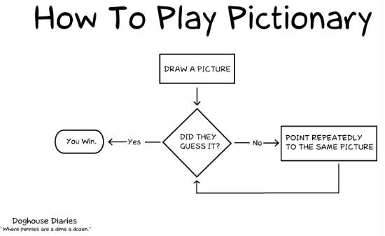
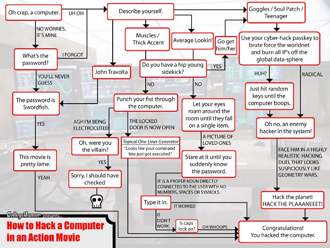
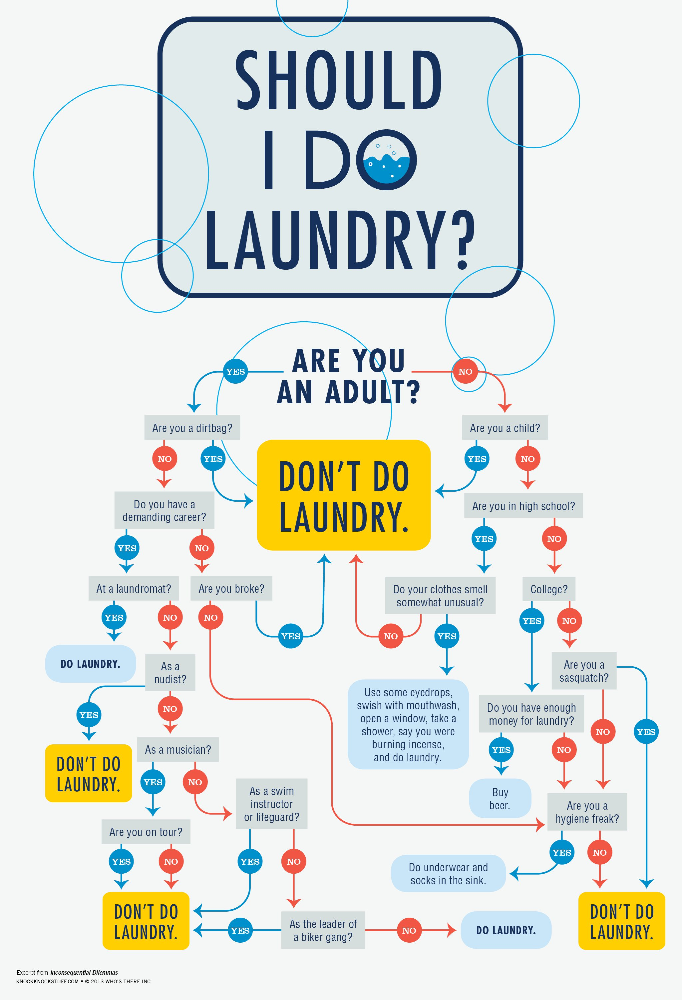

## Flowcharts

**Flowcharts** are diagrams that visually demonstrate an algorithm involving decision-making. Here are some great examples.

Source: Doghouse Diaries

Source: College Humor

Source: Inconsequential Dilemas

### Flowchart Symbols

There are over 20 standard symbols used in flowcharts, but you only need to knew these four for this activity.

| Symbol | Description |
| --- | --- |
|  Oval | A start or end point. |
|  Diamond | A question being asked. |
|  Rectangle | An action or process. |
|  Arrow | Shows what shape to go to next. Can be accompanied by text. |

 
### Creating Flowcharts 

You can create flowcharts on Google Docs using the Drawing tool. Go to **Insert>Drawing**, then select the **Shapes** tool. You can drag and drop them onto the drawing area then save the drawing to place it onto the document.

You can also create flowcharts using Microsoft software (e.g. Word, Powerpoint, Publisher, etc.) using the **Shapes** tool. 

There are also many free flowchart-making software, such as [draw.io](https://www.draw.io/).

Drawing them by hand isn't too bad, either.
