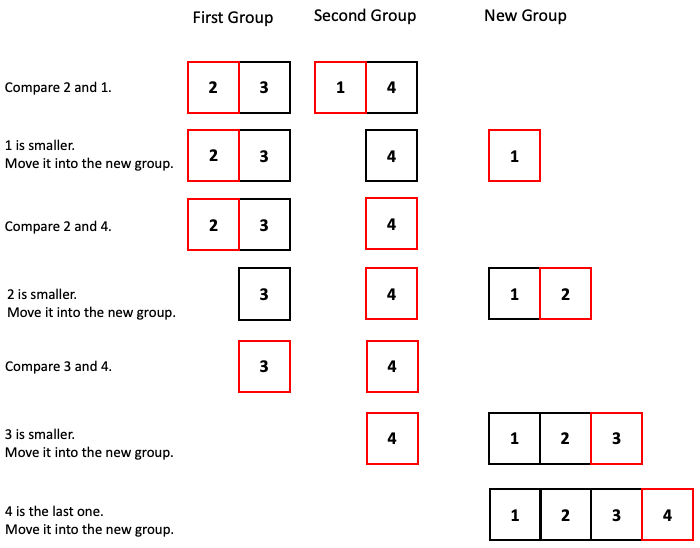
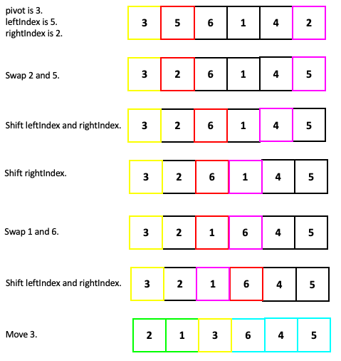

## Sorting Routines

**Sorting** is the process of putting items in a logical order, either from smallest to largest (ascending order), or largest to smallest (descending order). By default, when an array is sorted, we can assume it's in ascending order unless otherwise specified.

There are dozens of sorting algorithms commonly known. Here are visualizations of some common sorting algorithms: [15 Sorting Algorithms in 6 Minutes](https://www.youtube.com/watch?v=kPRA0W1kECg)

Here is another video on sorting algorithms: [Sorting Out Sorting](https://www.youtube.com/watch?v=SJwEwA5gOkM). 

This one was made in 1980 and is a classic. It's worth watching just for the retro sound effects. There is a short recap at the end if you don't want to watch the whole thing.

The following sorting algorithms will be discussed in more detail this lesson. You won't be expected to memorize which one is which. 
* Gnome Sort
* Bubble Sort
* Shaker Sort
* Insertion Sort
* Selection Sort
* Shell Sort
* Comb Sort
* Bogo Sort
* Merge Sort
* Quick Sort

They will be described using **pseudocode**, which is a combination of code and plain English. There are usually several variations for each sorting algorithms -- this lesson only has one variation for each sorting algorithm.

 
**Gnome Sort**

```
Let the index be 0
Do the following until index+1 is beyond the length of the array:
    If the element at the index is greater than the one after it:
        Swap them
        Let index = 0
    Otherwise:
        Increase the index by 1
```

The idea is that you have a garden gnome sitting at the first element in the array. The gnome looks at the next element and sees whether it is smaller than the one it is sitting at. If it is, it swaps them and goes back to the beginning; if it isn't it moves along and sits at the next element. It repeats this process until it is sitting at the last element in the array. Gnome Sort was originally named "Stupid Sort" due to it performing far more comparisons than actually needed.

 
**Bubble Sort**

```
Let the index be 0
Do the following until the array is sorted:
    Do the following until the index+1 is beyond the length of the array:
        If the element at the index is greater than the one after it:
            Swap them
        Increase the index by 1
```

The idea is that you have a bubble around two elements at a time. The bubble starts at the first two elements. If the elements in the bubble are not in order, they are swapped. The bubble then moves on to the second two elements. Again, it swaps the elements if they are not in order. It repeats this process until it reaches the end, then it goes back to the beginning and repeats the entire process over and over again until the entire array is sorted.

 
**Shaker Sort**

```
Let the index be 0
Do the following until the array is sorted:
    Do the following until the index+1 is beyond the length of the array:
        If the element at the index is greater than the one after it:
            Swap them
        Increase the index by 1
    Do the following until the index reaches 1:
        If the element at the index is less than the one before it:
            Swap them
        Decrease the index by 1
```

Shaker Sort is Bubble Sort with a twist. Once the bubble reaches the end of the array, it heads backwards until it reaches the start of the array. It keeps heading forwards and backwards until the array is sorted.


**Insertion Sort**

```
Let the index be 1
Do the following until the index is beyond the length of the array:
    Look at the element at the index
    Do the following until that element is greater than the one before it:
        Swap the element with the one before it
    Increase the index by 1
```

The idea is that after `n` iterations, the first `n` elements are sorted by inserting the last one into its correct place. The process continues until all the elements are sorted. 

Rather than swapping adjacent elements, another option is to directly insert the element into its correct place and move the ones after it forwards one spot.

 
**Selection Sort**

```
Let index be 0
Do the following until the array is sorted:
    Find the lowest element between the index and the end of the array
    Swap the lowest element with the one at the index
    Increase the index by 1
```

The idea is that after n iterations, the element that belongs in the nth spot is swapped in order to put it in its correct place. The process continues until all the elements are in their correct place.

 
**Shell Sort**

```
Let gap be half of the length of the array
Let index = 0
Do the following until the array is sorted:
    Do the following until index+gap is beyond the length of the array:
        Sort the elements at the following indices using bubble sort:
            index
            index+gap
            index+gap+gap
            etc.
        Increase index by 1
    Decrease the gap by a factor of 2 (i.e. divide it by 2)
```

Shell Sort is named after someone whose last name is Shell. It has nothing to do with seashells, nor the gas station, Shell.

The idea is that you split the array based on elements that are a certain gap apart. The elements that are the same gap apart are sorted, then the gap gets smaller and you repeat the process until the gap is less than 1. The gap starts at half the length of the array, then decreases by a factor of 2 every time.

 

**Comb Sort**

```
Let gap be the length of the array divided by 1.3 (rounded down)
Let index = 0
Do the following until the array is sorted:
    Do the following until index+gap is beyond the length of the array:
        Sort the elements at the following indices using bubble sort:
            index
            index+gap
            index+gap+gap
            etc.
        Increase index by 1
    Decrease the gap by a factor of 1.3 (i.e. divide it by 1.3)
```

Comb Sort is the same as Shell sort, except the gap starts at the length of the array divided by 1.3 and it decreases by a factor of 1.3 every time. The value 1.3 is supposedly the one of the ideal gap sizes, which minimizes the number of swaps necessary.

 

> Exercise 12-1
> 
> Download and open the [Sorting Examples](../Java_Programs/SortingExamples.zip) project. Play around with the GUI to see how each sorting algorithm sorts a given array. Look at the code for each sorting algorithm to see how they are implemented.
> 1. Find an array that takes 28 swaps for Gnome Sort, Bubble Sort, Shaker Sort, and Insertion Sort.
> 2. Find an array that takes 7 swaps for Selection Sort, Shell Sort, and Comb Sort.
> 
> See solutions [here](../Exercise_Solutions/Exercise-12-1.md).
    
    
> Exercise 12-2
> 
> Create flowcharts for each of the following sorting algorithms.
> * Gnome Sort
> * Bubble Sort
> * Insertion Sort
> * Selection Sort
>    
> Solutions:
> * [Gnome Sort](../Images/Gnome_Sort_Flowchart.png)
> * [Bubble Sort](../Images/Bubble_Sort_Flowchart.png)
> * [Insertion Sort](../Images/Insertion_Sort_Flowchart.png)
> * [Selection Sort](../Images/Selection_Sort_Flowchart.png)

  
**Bogo Sort**

```
Shuffle the array
Do the following until the array is sorted:
    If the array isn't sorted yet:
        Shuffle the array again
```

This is the true "Stupid Sort". Bogo Sort is intended to be a joke. It is impractical and is never guaranteed to terminate for long arrays. Never use it. Please.

 
### Better Sorting Algorithms

So far, all of the sorting algorithms are classified as inefficient. They are relatively simple to understand, but they do more comparisons and/or swaps than necessary. Merge Sort and Quick Sort are among the most efficient sorting algorithms, but they are more difficult to code.


 
**Merge Sort**

```
Split the array into groups of 1
Do the following until all the elements are merged:
    For each pair of groups:
        Merge them into a new sorted group
```

The merging phase is the following.

```
Do the following until the two groups are merged into one group:
    Compare the first elements of the two groups
    Take the smaller one, remove it, and put it at the back of the new group
```

Here is an example of what merging two groups of two can look like.



 
In older versions of Java (before Java SE 7), the `sort()` method in the `Arrays` class uses Merge Sort when the array is composed of a primitive data type.


**Quick Sort**

```
Let the pivot be the first element
Let the leftIndex be 1 and the rightIndex be the last index of the array
Do the following until the leftIndex is equal to or greater than the rightIndex:
    If the leftIndex is more than the pivot and the rightIndex is less than the pivot:
        Swap them
        Increase the leftIndex by one
        Decrease the rightIndex by one
    If the leftIndex is less than the pivot:
        Increase the leftIndex by one
    If the rightIndex is more than the pivot:
        Decrease the rightIndex by one
If the leftIndex is greater than the rightIndex:
    Move the pivot in between leftIndex and the rightIndex
If the leftIndex is equal to the rightIndex:
    Move the pivot to the leftIndex/rightIndex
```

After one iteration of Quick Sort, all the elements to the right of the pivot are greater than it, and all the elements to the right of it are less than it.

This process is repeated on the two smaller arrays until the entire array is sorted.

Here is an example of one iteration of Quick Sort on a small array.



At the end of the iteration, 3 is in the correct location. The process can be repeated on the green array and on the cyan array.

 The Java code for Quick Sort will be given in a future lesson.

In older versions of Java (before Java SE 7), the `sort()` method in the `Arrays` class uses Quick Sort when the array is composed of composite data type. The newest versions of Java uses Tim Sort (named after someone whose first name is Tim), which is a hybrid of Quick Sort and Insertion Sort.

 
### Stability of Sorting Algorithms

The **stability** of a sorting algorithm refers to whether it preserves the order of duplicate elements. A sorting algorithm is **stable** if it preserves the order of duplicate elements, and **unstable** otherwise.

This may seem unimportant, but when an array consists of objects, it is often desirable to preserve the order of objects with the same key (the attribute that is being sorted).

| Stable Sorting Algorithms | Unstable Sorting Algorithms |
| --- | --- |
| <ul><li>Gnome Sort</li><li>Bubble Sort</li><li>Shaker Sort</li><li>Insertion Sort</li><li>Merge Sort</li></ol> | <ul><li>Selection Sort</li><li>Shell Sort</li><li>Comb Sort</li><li>Bogo Sort</li><li>Quick Sort</li></ol> |
