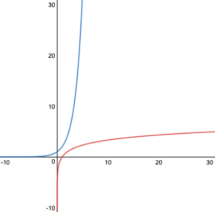

## Measuring Efficiency

### Worst Cases

The following are the number of swaps each sorting algorithm (same versions as the ones from the previous lesson) does. The variable n is the length of the array.

| | Worst Case Description | Worst Case's Number of Swaps |
| --- | --- | --- |
| Gnome Sort | array is in descending order | *n(n-1)/2* |
| Bubble Sort | array is in descending order | *n(n-1)/2* |
| Shaker Sort | array is in descending order | *n(n-1)/2* |
| Insertion Sort | array is in descending order | *n(n-1)/2* |
| Selection Sort | array is one cycle long | *n-1* |
| Shell Sort | array is one cycle long | *n-1* |
| Comb Sort | array is one cycle long | *n-1* |

As you can see, some of these comparison-based sorting algorithms are more efficient than others when it comes to the maximum number of swaps performed.

The efficiency of an algorithm is most often measured based on its worse case or its average case.

 
### Asymptotic Notation

**Big O Notation** is used to measure how efficient an algorithm is when it is given the worst case(s) possible. Efficiency can refer to how many tasks an algorithm performs, or how much space/memory an algorithm requires. For now, you'll just use it to measure how many swaps a sorting algorithm performs.

To write an algorithm's efficiency in Big O notation:
1. Look at the worst case.
2. Expand the expression.
3; Look the term that has the most influence on the shape of the graph (if it's a polynomial, it'll be the term with the highest degree).
4. Remove the coefficient on that term. If the term is a constant, change it to 1. If the term contains a logarithm, remove the base.
5. Put that term in parentheses and put a capital "O" in front of the left parenthesis.
 

| | Worst Case's Number of Swaps | Most influential term | Coefficient Removed | Complexity in Big O Notation |
| --- | --- | --- | --- | --- |
| Gnome Sort | *n(n-1)/2 = n2/2 - n/2* | *n2/2* | *n2* | *O(n2)* |
| Bubble Sort | *n(n-1)/2 = n2/2 - n/2* | *n2/2* | *n2* | *O(n2)* |
| Shaker Sort | *n(n-1)/2 = n2/2 - n/2* | *n2/2* | *n2*| *O(n2)* |
| Insertion Sort | *n(n-1)/2 = n2/2 - n/2* | *n2/2* | *n2* | *O(n2)* |
| Selection Sort | *n-1* | *n* | *n* | *O(n)* |
| Shell Sort | *n-1* | *n* | *n* | *O(n)* |
| Comb Sort | *n-1* | *n* | *n* | *O(n)* |

There is typically a high degree of variance among algorithms that have the same complexity. Regardless, Big O is commonly used to measure efficiency.

The tables above use the number of swaps as the measure of how efficient a sorting algorithm is. The most common way the efficiency is measured is the amount of time it takes to run, which is called the **runtime**. Both the number of swaps and the number of comparisons affect the runtime of these sorting algorithms.

These are the efficiencies that are most commonly referred to for these sorting algorithms. A capital omega Ω is used for best case, and a capital theta Θ is used for the average case.

| | Best Case | Average Case | Worst Case |
| --- | --- | --- | --- |
| Gnome Sort | *Ω(n)* | *Θ(n2)* | *O(n2)* |
| Bubble Sort | *Ω(n)* | *Θ(n2)* | *O(n2)* |
| Shaker Sort | *Ω(n)* | *Θ(n2)* | *O(n2)* |
| Insertion Sort | *Ω(n)* | *Θ(n2)* | *O(n2)* |
| Selection Sort | *Ω(n2*) | *Θ(n2)* | *O(n2)*|
| Shell Sort | *Ω(nlogn)* | *Θ(n2)* | *O(n2)* |
| Comb Sort | *Ω(nlogn)* | *Θ(n4/3)* | *O(n4/3)* |
| Bogo Sort | *Ω(n)* | *Θ(nn)* | unbounded |
| Merge Sort | *Ω(nlogn)* | *Θ(nlogn)* | *O(nlogn)* |
| Quick Sort | *Ω(nlogn)* | *Θ(nlogn)* | *O(n2)* |

There are five letters used in asymptotic notation:
* capital O (big O notation)
* capital omega (big Ω notation)
* capital theta (big Θ notation)
* lowercase O (small o notation)
* lowercase omega (small ω notation)

Their formal definitions are quite mathy, so you don't need to worry about them for this course. All you should know is that big O notation is used for the worst case, big omega notation is used for the best case, and big theta notation is used for the average case.

### Comparing Efficiencies

The following are ranked from most efficient to least efficient.

*O(1)* < *O(logn)* < *O(n)* < *O(nlogn)*

When comparing polynomial-time efficiencies, the lower the degree, the more efficient it is.

For example, *O(n)* < *O(n4/3)* < *O(n3)* < *O(n4)* < *O(n7)*

 
### Logarithms 

Most of you are already familiar with logarithms from your math courses, but if not, here is a brief explanation of them.

 
The *log* symbol in some of the cases in the table refers to the logarithmic function. 

Logarithms are used to solve exponential equations. For example, *2x = 8* is equivalent to *log28 = x* (read as "log 8 base 2").

A logarithm is an inverse of an exponent, so their graphs are mirrors of each other over the line *y=x*.

The blue curve is *f(x)=2x* and the red curve is *f-1(x)=log2x*.

 
### Measuring Searching Algorithms 

These are the efficiencies that are most commonly referred to for these searching algorithms. 

| | Best Case | Average Case | Worst Case |
| --- | --- | --- | --- |
| Linear Search | *Ω(1)* | *Θ(n)* | *O(n)* |
| Binary Search | *Ω(1)* | *Θ(logn)* | *O(logn)* |
