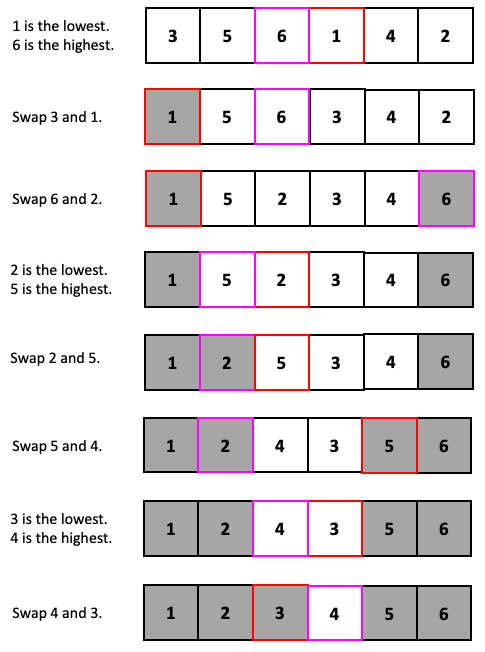

## Assignment: Sandwich Sort

Complete the following assignment and submit your work to the Sandwich Sort Dropbox.

 The following is an explanation for a sorting algorithm that I made up. 

Step 1: Find the lowest element and the highest element in the array, at the same time.
Step 2: Swap the lowest element with the element at the first index.
Step 3. Swap the highest element with the element at the last index.
Step 4: Repeat Step 1-3 using the same array but with the first and last element ignored.
 
Here is an example.



 
### Instructions

1. Create a flowchart demonstrating the Sandwich Sort.
2. Create a new project in NetBeans and call it "Sandwich Sort".
  1. In the Sandwich Sort class, create the following method given its documentation and initial line:
```java
/**
 * This method performs the Sandwich Sort algorithm on an array of integers.
 *
 * @param intArray an array of integers
 */
public static void sandwichSort(int[] intArray) {
```
  2. Test `sandwichSort()` by calling it under `main` and using various test cases. 
   3. When the program works, zip the file and name it **Assignment 10 - \<insert your name here>.zip**.
3. Submit the following to the Dropbox:
 * Your flowchart as an .pdf file or any reasonable image filetype (e.g. .png and .jpeg).
 * A .zip file of the program.
 * A .txt file (or a .docx file or a .rtf file) containing all of the code in the .java file.
 * A self-evaluation using the rubric below. 

### Rubric

The following rubric will be used to evaluate your assignment. Each row counts for 4 points, for a total of 16 points. 

You can download the rubric [here](https://docs.google.com/document/d/1JoS47smg_hGdhRVe5--LrkrHLnmUXfUrQ0WdT_bwk3s/edit?usp=sharing).

| Category | Level 4 | Level 3 | Level 2 | Level 1 | Below Level 1 |
| --- | --- | --- | --- | --- | --- |
| Knowledge and Understanding  | I demonstrated more than the expected amount of knowledge about implementing a sorting algorithm.  | I demonstrated the expected amount of knowledge about implementing a sorting algorithm.  | I demonstrated slightly less than the expected amount of knowledge about implementing a sorting algorithm.  | I demonstrated a small amount of knowledge about implementing a sorting algorithm.  | I demonstrated no knowledge about implementing a sorting algorithm. |
| Thinking | I put more than the expected amount of thought and consideration into testing my program. | I put the expected amount of thought and consideration into testing my program. | I put slightly less than the expected amount of thought and consideration into testing my program. | I put a small amount of thought and consideration into testing my program. | I put no thought and consideration into the testing my program. |
| Application | I followed all the instructions and there is a WOW factor. | I followed all the instructions but there is no WOW factor. | I followed most of the instructions. | I followed some of the instructions. | I followed none of the instructions. |
| Communication | The readability and tidiness of my code were beyond the expected quality. | The readability and tidiness of my code met the expected quality. | The readability and tidiness of my code didn't quite meet the expected quality. | The readability and tidiness of my code were far below the expected quality. | My code was not readable nor tidy at all. |

