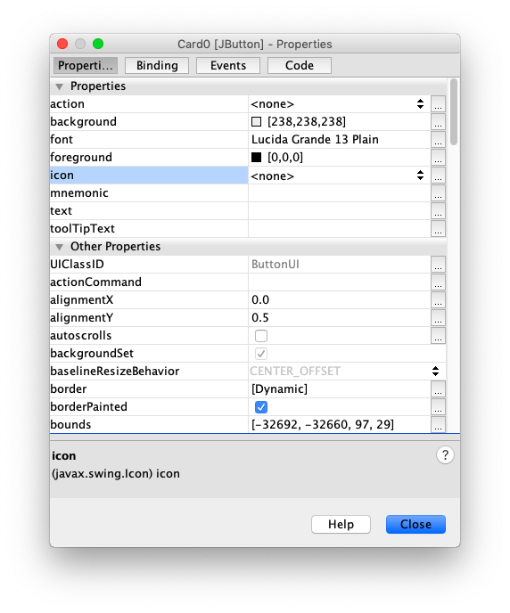

## Images In GUIs

In Java, you can use the `ImageIcon class` to display images on `JButton` objects.

To use it, put `import javax.swing.ImageIcon;` or `import javax.swing.*;` near the top of the file.

Place any images you'd like to use in the same folder as the java file.

 

You can use the following code to create an image icon for an image called icon.jpg, located in the src folder.

```java
ImageIcon icon = new ImageIcon("src/icon.jpg");
```

If the image is not in the src folder, you can replace src/ with the appropriate relative file path. Avoid using absolute file paths (e.g. "/Users/Sarah/Desktop/icon.jpg"). Using an absolute file path may cause your program to not work as expected on other computers.

To place this image onto `JButton` object, called `buttonName`, use the following code.

```java
buttonName.setIcon(icon);
```

If your button and image are the same dimensions, it should fit perfectly. There are apparently some issues images that are partially transparent, in which case you'll want the button to be slightly larger than the dimensions of the image.


To retrieve the current icon on a button, you can use this.

```java
buttonName.getIcon();
```


To remove an image from a button, you can use this.

```java
buttonName.setIcon(null);
```

If you'd like a button to begin with an image already displayed on it, right click on the button and go to **Properties**. There will be a property called **icon**, with a dropdown menu of all the images played in the src folder.



If the image you want isn't showing up, click on the square with the ellipsis. You should be able to locate the image file now.


Avoid grabbing images outside of the package, so that you program will work on other computers.


> Exercise 13-3
> 
> Download and run the [Memory Game](../Java_Programs/MemoryGame.zip) project. Play the game and read the code to learn about how it uses the `ImaceIcon` class.
> 
> The images are originally from [here](https://cs.nyu.edu/courses/spring13/CSCI-UA.0061-001/newcards/pages/02%20of%20Clubs.html). 
