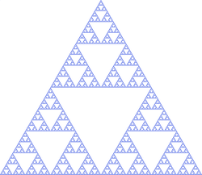
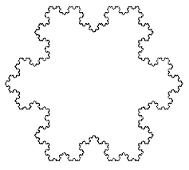
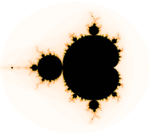

## Recursion

Many of you have already taken, or are currently taking, the Grade 11 math course *Functions* (MCR3U) or *Functions and Applications* (MCF3M).

In math, a **recursive function** is a discrete function whose definition includes the function itself. It requires at least one base case (which determines the edge of the domain).

In computer science, a **recursive method** is a method that calls itself within the body of the method. The base case(s) determine(s) when the method stops running.

> Exercise 16-1
> 
> Search the word *recursion* on Google. What happens?
> 
> [See image](../Images/Recursion.md).


### Fibonacci Sequence

One of the most classic examples of recursion is the Fibonacci sequence: 1, 1, 2, 3, 5, 8, 13, 34...

The definition is *f(n) = f(n-1) + f(n-2), f(1) = f(2) = 1*, *n ∈ ℕ*. The base cases are *f(1) = 1* and *f(2) = 1*, which indicate that the first two values are 1 and 1. Every other value is calculated by adding the previous two values. 

*ℕ* represents the set of natural numbers. However, it is debatable among mathematicians whether 0 is considered to be a natural number. You can often figure out from context which definition of "natural numbers" is used. Here, it is used to represent the positive integers. 0 is neither positive nor negative.

You could write a method to calculate the n<sup>th</sup> Fibonacci number like this:

```java
/**
 * This method takes an integer n and returns the nth number in the Fibonacci sequence.
 *
 * @param n a positive integer
 * @return the nth Fibonacci number; if n isn't a positive integer, it returns -1
 */
public static int fibonacci(int n) {
    if (n < 1) return -1;
    if (n == 1 || n == 2) return 1;
    else return fibonacci(n - 1) + fibonacci(n - 2);
}
```

How does this method work? Let's trace `fibonacci(4)` to see what happens.


`fibonacci(4)`    
=> `fibonacci(3) + fibonacci(2)`    
=> `fibonacci(2) + fibonacci(1) + fibonacci(2)`    
=> `1 + 1 + 1`    
=> `3`

Let's try again with `fibonacci(6)`.

`fibonacci(6)`    
=> `fibonacci(5) + fibonacci(4)`    
=> `fibonacci(4) + fibonacci(3) + fibonacci(3) + fibonacci(2)`    
=> `fibonacci(3) + fibonacci(2) + fibonacci(2) + fibonacci(1) + fibonacci(2) + fibonacci(1) + 1`    
=> `fibonacci(2) + fibonacci(1) + 1 + 1 + 1 + 1 + 1 + 1`    
=> `1 + 1 + 1 + 1 + 1 + 1 + 1 + 1`    
=> `8`

> Exercise 16-2
>
> Write a Java program for the tribonacci sequence. The tribonacci sequence is like the Fibonacci sequence, except the first three terms are 1, and all other terms are the sum of the three preceding terms.
> 
> Download solution [here](../Exercise_Solutions/Exercise-16-2.md).


### Factorials!

Another classic example of a recursive function is the factorial operation, which is denoted by an exclamation mark. The value *n!* is the product of all the natural numbers up to and including *n*. The definition is *n! = n \* (n-1)*, *0! = 1! = 1*, *n ∈ ℕ*. 

You could write a method to calculate *n!* like this:
```java
/**
 * This method takes an integer n and returns the value of n!
 *
 * @param n a non-negative integer
 * @return n!; if n is a negative integer, it returns -1
 */
public static int factorial(int n) {
    if (n < 1) return -1;
    if (n == 0 || n == 1) return 1;
    else return n * factorial(n - 1);
}
```

### Euclidean Algorithm 

Recursion can be used to calculate the greatest common factor (GCF) between two integers, using the identities `gcf(a, b) == gcf(b, a % b)` and `gcf(a, 0) == a`. This process is called the Euclidean algorithm.

You could write a method to calculate the GCF of two numbers like this:

```java
/**
 * This method takes two non-negative integers and calculates their GCF
 *
 * @param n a non-negative integer
 * @param m a non-negative integer less than or equal to n
 * @return the greatest common factor of n and m; -1 if n or m is negative
 */
public static int gcf(int n, int m) {
    if ((n < 0) || (m < 0)) return -1;
    if (m == 0) return n;
    else return gcf(m, n % m);
}
```


### Fractals

A fractal is a geometrical pattern that repeats indefinitely and in which every smaller component is related to the whole. Some examples include the Sierpinski Triangle, Koch Snowflake, and the Mandelbrot Set.

| Sierpinski Triangle | Koch Snowflake | Mandelbrot Set |
| --- | --- | --- |
|  | | |


> Exercise 16-3
> 
> 1. Why are fractals an example of recursion?
> 
> The Tower of Hanoi is a game that involves placing disks on pegs. You can play it [here](http://www.dynamicdrive.com/dynamicindex12/towerhanoi.htm).
> 
> 2. Why is this game an example of recursion?
> 
> See solutions [here](../Exercise_Solutions/Exercise-16-3). 

   
### Issues with Recursion

Recursion can be used to create efficient programs, but it can also be used to create inefficient programs. In the case of Fibonacci numbers, the number of recursive calls grows exponentially as the Fibonacci number increases.

There is also the issue of infinite recursion. Similar to infinite loops, an infinite recursion never terminates. This often occurs when the base cases do not cover all bases.

Sometimes, recursive functions can be rewritten in closed form (i.e. an expression that doesn't involve recursion). When this is possible, it is more efficient to implement the closed form expression.
