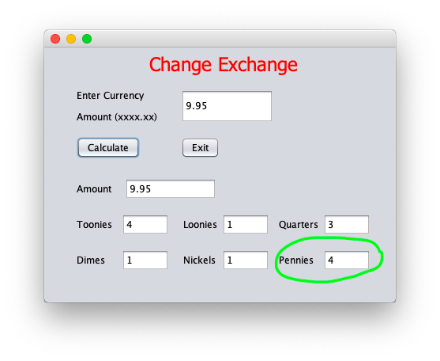

## Finite Data Representation

### Integer Overflow and Underflow

All computers use a fixed number of bits to represent data. This means that there are limits as to what integers a program can use.  

Java uses 64-bit data representation: the lowest integer it can store is -231 and the highest integer it can store is 231 - 1. You can use `Integer.MAX_VALUE` and `Integer.MIN_VALUE` to obtain these values.

When you try to compute a value beyond this domain, it is called **integer overflow** (beyond `Integer.MAX_VALUE`) or **integer underflow** (beyond `Integer.MIN_VALUE`).

Fun fact: The Ariane 5 rocket launch in 1996 failed due to an integer overflow error. The rocket self-destructed and the damage cost approximately $370 million USD! Here is a video of the launch: [Ariane 5 Rocket Launch](https://www.youtube.com/watch?v=i67ycNPceHc).

> Exercise 16-4
> 
> What is the result when you run the following lines of code? What can you deduce about how Java treats integer overflow and underflow?
> 1. `System.out.println(Integer.MAX_VALUE + 1);`
> 2. `System.out.println(Integer.MIN_VALUE - 1);`
> 3. `System.out.println(Integer.MAX_VALUE + Integer.MAX_VALUE );`
> 4. `System.out.println(Integer.MIN_VALUE - Integer.MIN_VALUE);`
> 
> See solutions [here](../Exercise_Examples/Exercise-16-4.md).

### Precision of Double and Float

You may have noticed from the *Change* assignment that sometimes the result is slightly off even though the math checks out.

 

This inaccuracy is due to rounding errors when dividing using finite data representation. Only 93.1% of the values from $0.00 to $9.99 are actually accurate in the *Change* assignment, unless you modified the structure of the algorithm.

Inaccuracy caused by finite data representation is often frustrating. Be aware that if a calculation in any of your programs seems to be off, it might be that your algorithm may be fine and the Java simply can't accurately perform the calculation.

> Exercise 16-5
> 
> Create a program that uses a loop to determine which of the monetary values inclusively between $0.00 and $9.99 are inaccurate in the *Change* assignment.
> 
> See solution [here](../Exercise_Examples/Exercise-16-5.md).

