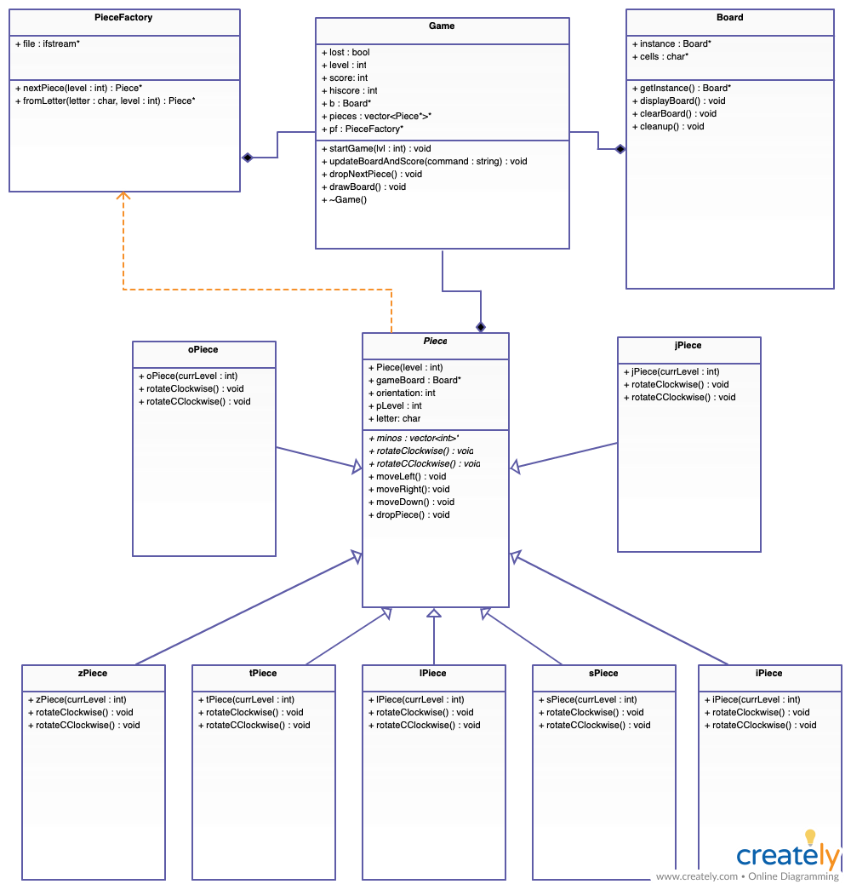

## Unified Modelling Language

**Unified Modelling Langauge** (UML) is a popular standard for modelling relations in OOP. It is not specific to Java.

### Classes

Each class (or interface) is represented by a rectangular box divided into three sections. The top section contains the name of the class, the middle section contains the names of the fields and the bottom section contains the names and parameters of the methods.

**Top Section**
* If it is an interface, **\<<Interface\>>** is written directly above the interface name.
* If it is an abstract class or an interface, it is written in *italics*. If you are writing/drawing by hand, you can use cursive as an alternative.

**Middle and Bottom Section**
* The middle section may be omitted if there are no fields.
* To the left of each field and method is one of the following signs: **+**, **-**, and **#**.  
  The **+** sign stands for `public`, **-** stands for `private`, and **#** stands for `protected` (or package-protected).
* Method names are followed by a set of parentheses. If there are parameters, their names are written in the set of parentheses.
* To the right of each field, parameter, and method is a colon followed by the type (for a field) or the return type (for a method).
* Constructors are not followed by a colon and return type (since there isn't one, not even `void`). 
* If a field or method `static`, it is underlined.
* Abstract methods are in italics. If you are writing/drawing by hand, you can use cursive as an alternative.

### Relations

Aggregation is denoted by a line that has a white/blank diamond on one end (the subclass). Near the arrowhead, you can include how many the subclass objects are contained in the superclass, and what their names are. When writing how many of them there are, you can use "**..**" notation to denote a range (e.g. "**1..5**" means 1 to 5 inclusively and "**2..\***" means 2 or more).

Composition is denoted similarly to aggregation, except the diamond is entirely black.

Inheritance is denoted using a line with one arrow on one end (the superclass). The line can be accompanied with the word "extends" or "implements".

When two classes have a loose connection to each other (e.g. one of them has a method that has an object of the other class as a parameter), you can use a dotted line to connect them, with arrows on the appropriate end(s).

Here is an example of a UML diagram for a Quatris program, written in C++. Quatris is a variation of Tetris. 
    

> Exercise 18-4
>
> Old Maid is a card game that involves drawing cards from your opponents' hands, and removing pairs, until you run out of cards or are left with a Joker card. This [OldMaid](../Java_Programs/OldMaid.zip) program simulates this game, and has several classes: OldMaidGame, Deck, Card, JokerCard, RegularCard, Player, HumanPlayer, and ComputerPlayer.   
> 
> Draw a UML diagram that shows the relationship among all the classes. For simplicity, omit the fields and methods for the OldMaidGame class (there are a lot of them).
> 
> See solution [here](../Images/OldMaid_UML.png).

