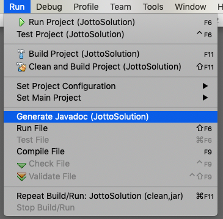
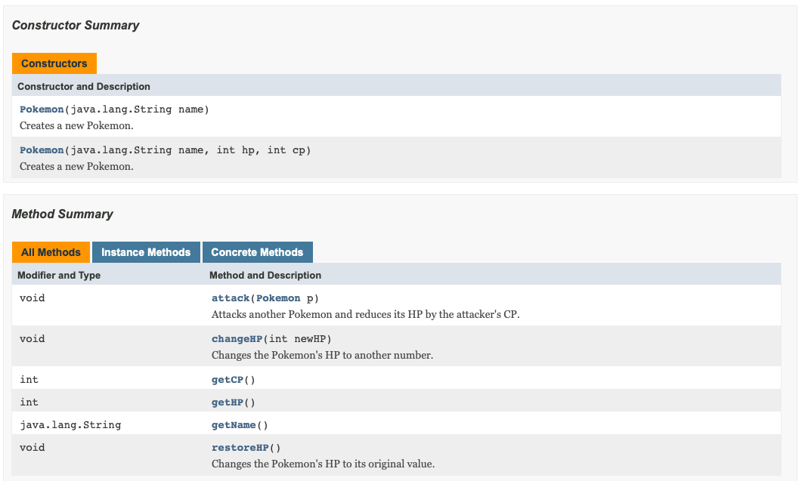
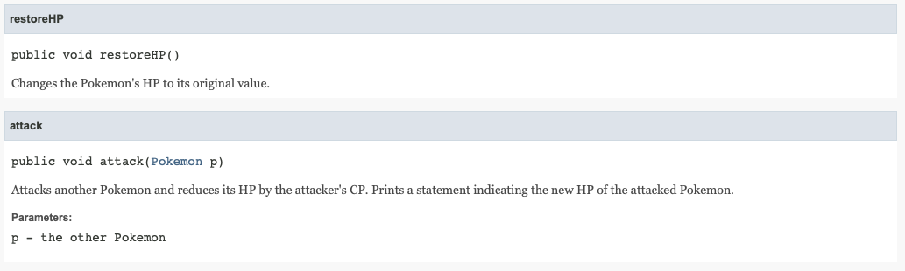

## Javadoc

Throughout this course, you have been using the Java API to find information about built-in classes and their methods.  A Javadoc looks a lot like the Java API, except it gives information about the custom classes in your program.

To build a Javadoc of a Java program in Netbeans, go to **Run > Build Javadoc**.

This will generate HTML files corresponding to your classes and place them into the *dist* folder in your project. 

The index.html file lists all of the classes in your program, with hyperlinks to their respective HTML files. This file might automatically open in your browser when you generate the Javadoc.  

Here is part of the Javadoc for the original Pokemon class in the Pokemon Battle assignment.

Further down the page, you can see more documentation on the methods.

All comments beginning with `/**` are recognized as a part of the Javadoc . This is why it's important to document your methods using `/**` as opposed to `/*` or `//`, and to use tags such as `@param` and `@return`.
