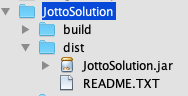

## JAR Files

So far, you've been running your Java apps through NetBeans. You can share your Java apps with people who don't have a Java IDE such as NetBeans installed by converting your program to the .jar filetype. JAR stands for **J**ava **Ar**chive, and the filetype is executable on both PCs and Macs. 

You can create a .jar file from NetBeans. Click into a project, then go to **Run > Clean and Build Project**. This will update the files in the *build* folder and place the .jar file into the *dist* folder.

From outside of NetBeans, you can click on the .jar file, and your program should open.

If it doesn't open, it is likely because your program does not compile (i.e. something doesn't work). If your program reads from a non-Java file, or uses an image, you need to ensure that these files are appropriately located with respect to the .jar file; otherwise, it won't compile.

For example, the Jotto Program relies on jottoWords.txt. This textfile needs to be in the same folder as the .jar file in order for the code `File jottoFile = new File("jottoWords.txt");` to work.

If you used an image and you create an ImageIcon object using code such as `new ImageIcon("src/image.jpeg");`, your src folder needs to be in the same folder as the .jar file.

### Sending JAR Files

When sending a .jar file, it is customary to zip the folder that contains it, then send the zipped folder. If you are sharing your program with someone, you would instruct them to unzip the folder, open the .jar file (you might have to right click on it in order to open it), and not move the .jar file from its location. You can choose to include this information in the README.txt file, which should be included the folder.
