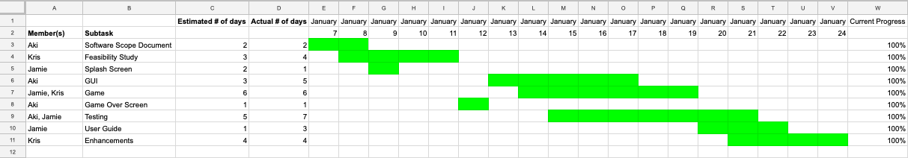

## Software Development Life Cycle

Large projects are managed by being divided into the stages of the Software Development Life Cycle (SDLC).

There are several versions of the SDLC. For the Cumulative Task, you will be following these five stages.

| | |
| --- | --- |
| Stage 1:  **Analysis** | <ul><li>Receive software requirements from the client.</li><li>Discuss ideas from other team members.</li><li>Divide up the work and and assign roles (project manager, head programmer, graphic artist).</li><li> Prepare a **software scope document**.</li></ul> |
| Stage 2:  **Design and Development** | <ul><li>Prepare a **feasibility study**.</li><li>Create a project schedule with deadlines for subtasks.</li><li>Create flowcharts for complex algorithms.</li><li>Create a UML diagram with all the custom classes.</li></ul>|
| Stage 3:  **Implementation** | <ul><li>Produce code for the application.</li><li>Maintain a project log using a **Gantt chart**.</li><li>Produce a **user guide**.</li></ul> |
| Stage 4:  **Testing** | <ul><li>Individual program testing.</li><li>Produce a **software test document**.</li></ul> |
| Stage 5:  **Maintenance** | <ul><li>Review the project log.</li><li>Write a reflection on the successes, challenges, and limitations of your work.</li></ul> |

There are various SDLC models that indicate how many times and in what order these steps are executed.

You will be using the **Prototype Model**, which involves repeating the cycle once to create a prototype, then revisiting the steps to enhance the program.

  
### Software Scope Document

A software scope document is a brief document that describes what the piece of software is and what it is for. For the Culminating Task, it should be no more than 300 words and include the following information.

| | |
| --- | --- |
| **Software Development Team**	| <ul><li>Names and roles of your team members</li></ul> |
| **Problem Statement** | <ul><li>Project background</li><li>Stakeholders</li><li>Users</li><li>Risks</li></ul> |
| **Vision of the Solution** | <ul><li>Vision statement</li><li>List of features</li><li>Features that will not be developed</li></ul> |

### Feasibility Study

A feasibility study looks at the entire project and determines what is possible, valid, and worthwhile. Creating a feasibility study allows the developers to not waste time during the implementation phase. For the Culminating Task, you will include the following as a part of your feasibility study.

| | |
| --- | --- |
| **Problem Definition** | <ul><li>A short one-paragraph description of the application that you plan to create, including basic information about the game.</li></ul> |
| **Problem Analysis** | <ul><li>A description of any constraints or problems that you expect to encounter, and how you intend to deal with them. Examples:</li><ul><li>Application creation:</li><ul><li>is 3 weeks enough time to complete it?</li><li>what to do if you can't figure out how to code something</li><li>what to do if an issue is too difficult to debug</li><li>what to do if you feel you can't finish by the deadline</li></ul><li>User constraints:</li><ul><li>software and hardware required to run the application</li><li>knowledge the user needs in order to open and run the application and play the game</li><li>time the user will need to learn how to play the game</li></ul></ul></ul> |
| **End User Requirements**	| <ul><li>A summary of the information received from the client. If any clarification or extra information is needed, contact the client and ask for it.</li></ul> |
| **Statement of Work**	| <ul><li>An extension of the software scope document. It consists of the following: <ul><li>a resource list that contains a list of all required resources (e.g. person, hardware, space) and their availability</li><li>a work breakdown and a set of time estimates related to how long it will take to develop each of the features of the application</li><li>a project schedule</li><li>a risk plan that identifies any potential risks, and indicates how these would be handled should they occur</li></ul> |

### Gantt Chart 

A Gantt chart is a tool that helps visualize, schedule, and track the progress of a project. For the Culminating Task, your Gantt chart will includes the following information:

* A list of all the subtasks and who is/are assigned to each one.
* An estimate of the time (in days) each subtask is expected to take.
* The estimation of the current progress (in percentage) of each subtask.
* A visualization of when each subtasks is being worked on. 

Here is an example of what a Gantt Chart for the Culminating Task could look like after it has been completed. You can download the file [here](https://docs.google.com/spreadsheets/d/1CdlHra19lMxfOedDORVVGbGKIRWWRwRSHqSpdqKhlZo/edit?usp=sharing).

### User Guide

A user guide is a manual explaining how to use the game. For the Culminating Task, you will include the following in your user guide.
* A title page.
* A description of what the game is.
* A description of how to open the game.
* An explanation of how to play the game.
* Frequently asked questions (FAQs).

### Software Test Document

A software test document serves as a way to track how the program has been tested. A software test plan is typically very detailed and contains a lot of components, but yours will not need to be as detailed. 

For the Culminating Task, you will include the following in your software test plan. You may use [this template](https://docs.google.com/spreadsheets/d/1jHs8G6D7O6tnEEVtMIYRVE5CS77fgDW2o-mhEr5ZUS4/edit?usp=sharing), or create your own.
* Blackbox tests (i.e. tests that ignore the internal implementation).
* Whitebox tests (i.e. tests that are specific to the internal implementation).
* Bugs and issues encountered, and how and when they were fixed.
