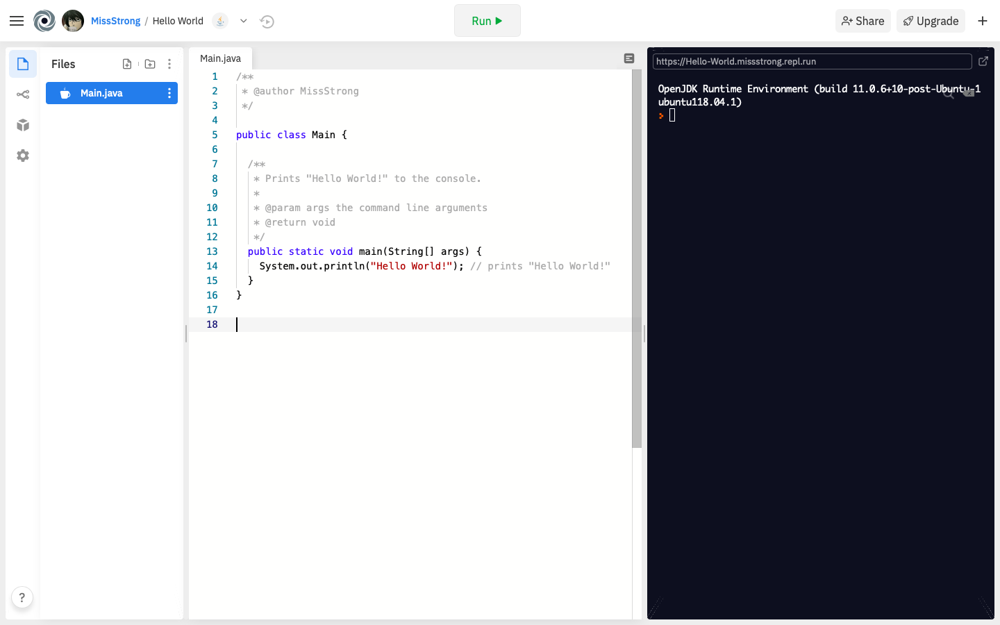

## Note – Print Statements

### The Console

The **console**, also known as the output window, is the default location where text gets printed to.

In repl.it, the console is the black window on the right side of the screen.



### Hello World!

When using a programming language for the first time, it is traditional to run a program that prints "Hello World!".

The above image is an example of the Hello World program in Java using repl.it. When you hit *Run*, the text "Hello World!" is printed to the console. 

### System.out.println()

The most common method for printing in Java is `System.out.println()`. *Println* is pronounced as *print line*. When you use this method, it **must** be inside of the `main()` method or a custom method in order for it to work. You cannot use just `println()` on its own – you need to write `System.out.println()` in full so that the interpreter knows where to find the method you're using (there may be different `println()` methods in other locations).

In the example above, `System.out.println()` takes the string `"Hello World!"`, but it can also take numbers, booleans, characters, and other data types. The next lesson will cover different data types in Java. The semicolon at the end of the method call is necessary for the program to run.

### System.out.print()

Another common method for printing in Java is `System.out.print()`. Notice that it does not have *ln* at the end. This method is similar to `System.out.println()`, except it does not place a newline character at the end of the output.

```java
// Prints "HelloWorld!" on one line. 
// Anything else will go immediately after "!" on the same line.
System.out.print("Hello");
System.out.print("World!");
```

```java
// Prints "Hello" and "World!" on two separate lines. 
// Anything else will go on a separate line.
System.out.println("Hello");
System.out.println("World!");
```

