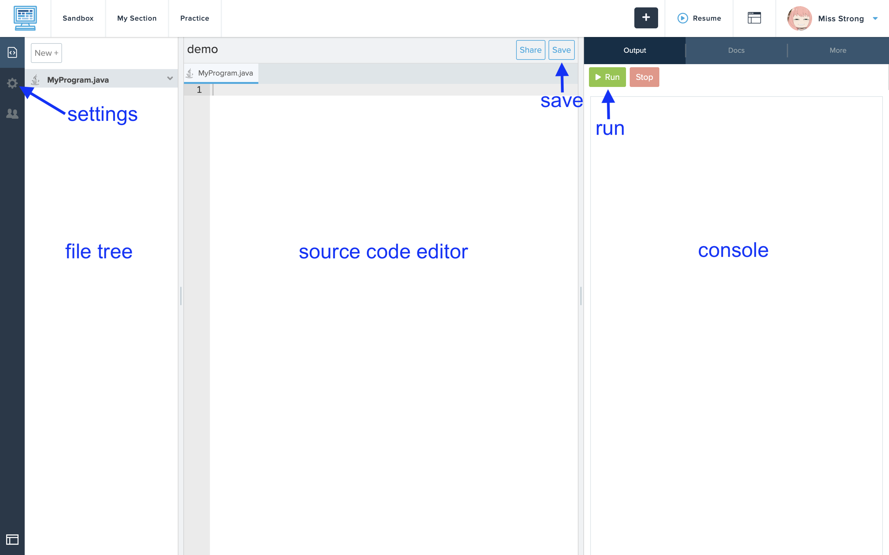

# [Link to video.](https://www.youtube.com/watch?v=AvNqezv_QSk&list=PLVD25niNi0BnyWtuQTSchyZWbQrMq_PUu)

### CodeHS

In this course, we will be using [CodeHS](http://codehs.com) to write Java programs. CodeHS is a web-based programming environment. It is not the best programming environment, however we are using it since it can run on Chromebooks.

### Sandbox

We can create programs through the Sandbox. Click on **Sandbox** in the top-left corner.

Enter a name for your program and click **Create Program**.

Here is what our programming environment on CodeHS looks like:

Select **Java** as the progam type and click **Create Program!**.

Here is your programing environment:

### File Tree

The **file tree** is the list of files and folders that make up a program. For now our programs will just be one file called **main.py**. The **py** file extension is for Python files.

### Source Code Editor

The **source code editor** is the place where we type in the code for our program. In CodeHS, the source code editor is the window in the middle of the screen. The numbers along the left side of the source code editor are the **line numbers**.

The source code editor displays our code using **syntax highlighting**. Different parts of our code light up in different colours based on various categories. Different source code editors have different colour schemes.

We will see **red squiggly lines** when we have a syntax error, similar to how we see a red squiggly line when we mispell a word in a text editor such as Google Doc. **Syntax** refers to the rules of a programming language, similar to how grammar refers to the rules of a human language. We will also see **green squiggly lines** for warnings.

### The Console

The **console**, also known as the output window, is the default location where text and error messages gets printed to. In programming, **printing** refers to displaying text somewhere on the screen.

The console is the black window and by default it's on the right side of the screen.

### Settings

We can click on the gear icon (⚙️) on the left side of the screen to access the settings. Here we can change things like the theme and font size.

### Checking Your Code

Within most of the exercises, you will be able to check whether your code works by clicking on **Check Code**. It will give you feedback when something is wrong with your code.

### Assigment Statuses

The status of each assignment is colour-coded. You can learn what each colour means by hovering over the colours in the legend.

