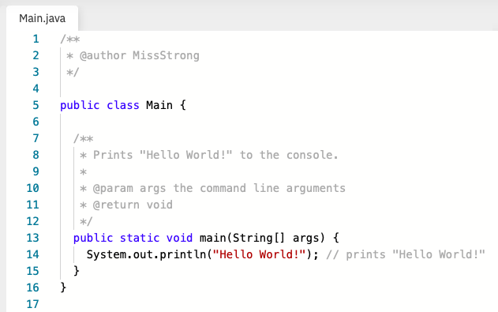

## Introduction to Java

Java is a programming language similar to C++ and Turing. It is known for being an purely object-oriented programming language. (We'll get to what object-oriented means in a later lesson.)

Java has a moderate learning curve – it can be challenging to learn at first and some of its limitations can be frustrating at first. However, once we have become accustomed to the programming conventions in Java, it allows us to be highly productive and create complex programs.

Java has consistently been in the top three most popular programming langauges over the past two decades. Other languages that have been consistemtnly popular include Python, C, and Javascript.

### Java Code

Here is an example of the classic "Hello World" program, in which `Hello World` is printed to the screen.

Here are some things worth noting now.

#### 1. Comments

Comments are used to write words in our program to help explain what is going on. There are two types of comments: single-line and multi-line. 

* **Multi-line comments** take up multiple lines of code. They start with `/*` or `/**` and end with `*/` (the `*` at the beginning of each line in between is optional). 

* **Single-line comments** take up only one line of code or one partial line of code. They start with `//`. These types of comments are typically used to provide a brief decription of what's going on in a particular line of code.

Multi-line comments that begin with `/**` can include **tags**, which begin with a `@`. There are three examples of tags in the above image: 

* Line 2: The `@author` tag, which shows who wrote the program.
* Line 10: The `@param` tag, which lists and describes the parameters used in a function.
* Line 11: The `@return` tag, which describes what a function returns when it is run.

#### 2. Classes

Every file should contain a class that matches the name of the file. In the example shown in the image, the only class in the program is `Main`, which matches the filename  `Main.java`.

Rules for class names:

* The first character is an upper case letter. The name cannot begin with a number.
* If there is more than one word, every word begins with a capital (e.g. HelloWorld).
* There are only letters and numbers. There are no underscores or other special symbols.

A class should be one of the following: `public`, `private`, or `protected`. If none of these are specified, the class becomes package-private. We'll get to what each of those mean later in this course. For now, we'll label each class as `public`.

#### 3. Methods

A method is a function that is contained in a class. Since every function in Java is contained in a class, every function in Java is a method. The words *method* and *function* can be used interchangeably in Java.

When defining a method, we would write the following, in order:

1. `public`, `private`, or `protected` (or leave it blank for package-private)
2. `static` (or leave it blank if it's non-static)
3. the return type (e.g. `int`, `String`, etc.) (or write `void` if the method doesn't return anything)
4. the name of the method
5. the parameters of the method enclosed in parentheses
6. a left curly brace `{`
7. the body of the method
8. a right curly brace `}`

Rules for creating method names:

* It can be a word or a phrase.
* It should contain start with a verb. 
* The first character is an lower case letter. The name cannot begin with a number.
* If there is more than one word, all other words begins with a capital (e.g. `getItem()`).
* There are only letters and numbers. There are no underscores or other special symbols.

When we are talking about a method, we can append `()` at the end of its name to make it clear that it is a method, not a variable.

At least one class in a Java program should contain a `main()` method. The content of a `main()` method is run when we run our program. In Java, the `main()` method must be `public`, `static`, and return a `void` value. The `main()` method has the parameter `String[] args`. (We'll get to what this means in a later lesson.)

### Writing Java Code Using Replit

In this course, we will be using [Replit](http://replit.com) to write Java code. Replit is a web-based programming environment. It is not the best programming environment, however we are using it since it can be used on your Chromebooks as does not require you to download any software.

Here are a few things worth noting about writing Java code in Replit that are different than other programming environments:

* The top-level class is called `Main` by default and cannot be renamed. (We'll get to what top-level means in later lesson.)
* The `main()` method must be inside the `Main` class. 
* Files are not auto-filled when we first create them. We might have to do a lot of copy-pasting from other files when getting started.
* [Javadocs](https://www.geeksforgeeks.org/what-is-javadoc-tool-and-how-to-use-it/) are only partially supported. These include tags in multi-line comments that begin with `/**`. Typically, we can use Javadocs to auto-generate a summary of documentation for each class and method, but we cannot do that with Replit unfortunately.
