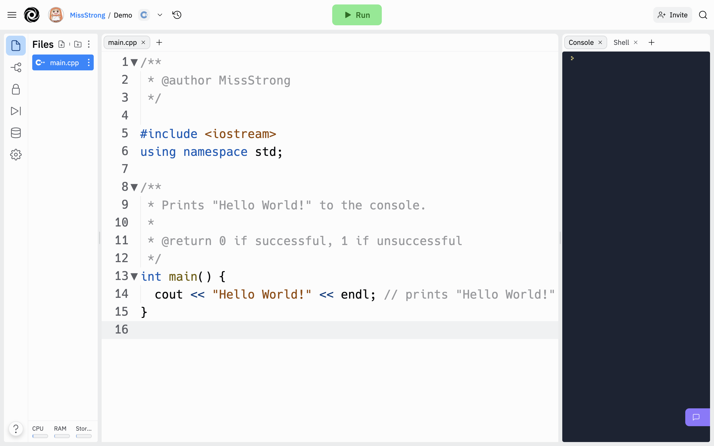

# [Link to video.](https://www.youtube.com/watch?v=MqtUpWpUhJs&list=PLVD25niNi0BkgQHyEFkuuBp_IQ4q67jIC)

### Print Statements

### The Console

The **console**, also known as the output window, is the default location where text gets printed to.

In Replit, the console is the black window on the right side of the screen.



### Hello World!

When using a programming language for the first time, it is traditional to run a program that prints "Hello World!".

The above image is an example of the Hello World program in Java using repl.it. When we hit *Run*, the text "Hello World!" is printed to the console. 

### cout <<

`cout` is pronounced as "C out" and is used alongside the `<<` operator, read aloud as "put to", to put text to the console. The arrows in the put to operator point to the direction of flow. 

Anything that comes after `<<` gets printed. It doesn't have to be a string.

```cpp
cout << 7 << endl; // prints 7
cout << 7.9 << endl; // prints 7.9
```

Unfortunately, booleans don't get printed as words. `true` becomes `1` and `false` becomes `0`.

```cpp
cout << true << endl; // prints 1
cout << false << endl; // prints 0
```

If we use `<<` more than once, each output will appear with no spaces between them

```cpp
cout << "Hello" << "World" << endl; // prints "HelloWorld"
```

### endl

`endl` is pronounced as "endline" and is equivalent to a newline character '\n'. Using `endl` is just a clearer way of indicating a newline than appending "\n" to a string.

```cpp
cout << "Hello World\n"; // same thing as `cout << "Hello World" << endl;`
```

### namespace std

The identifiers `cout` and `endl` belong to the `std` (**st**andar**d**) namespace. If we didn't have the line `using namespace std;`, we would need to write `std::cout` and `std::endl` instead of just `cout` and `endl`.
