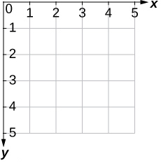

# [Link to video.]

### Graphical User Interfaces

A **Graphical User Interface** (GUI, pronounced "gooey") is a way of interacting with a computer. Examples of GUIs include windows, icons, and menus. 

We'll be using JSwing to create GUIs in repl.it.

### JSwing Frames

The graphics window will contain a frame for us to put our graphics on. The data type of a frame in JSwing is called a `JFrame`. We can make a frame display like this:

```Java
// Initializes the frame
JFrame frame = new JFrame();

// Sets the size of the frame
frame.setSize(400, 300);

// Makes the background of the frame grey
frame.setLayout(null);

// This line is needed to make the frame appear
frame.setVisible(true);
```

To make use of many features in JSwing, we should import the following libraries:

```Java
import javax.swing.*; // This is for the components
import java.awt.*; // This is for the fonts and colours
import java.awt.event.*; // This is for the action listeners
import static java.awt.event.KeyEvent.*; // This is for the key listeners
```

### Screen Coordinates

Before we go into GUI components, it'll be important to know that coordinates in programming are different than coordinates in math. 

In math, 2-dimensional coordinates can be graphed on a Cartesian Plane like this:


In computer science, we don't use the Cartesian plane for coordinates. Instead, the coordinate system we use looks like this:



For example, if we are referring to a specific pixel in an image, we would use this coordinate system instead of the Cartesian plane. 

The idea is that this is similar to how we would refer to cells in a table: The row number followed by column number, with Row 0 Column 0 representing the cell in the top-left corner. This is also similar to how we read in English: left to right, top to bottom.

The coordinate (0, 0) is referred to as the **origin**. When programming, **the origin is always at the top-left corner**. 

In math, the origin is at the center of the Cartesian plane. If we are only using the positive quadrant of the Cartesian plane, the origin is at the bottom-left corner.
