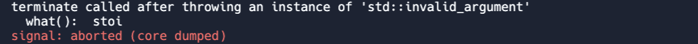

<!-- # [Link to video.]() -->

### Exception Handling

Whenever we run a program that has errors, we may have noticed that Replit attempts to tells we what kind of error it is. 

For example, if we try to convert a string into an integer using `stoi()`but the string contains non-numeric characaters, we get a message in the console saying that there was an **exception** called `invalid_argument`.



An exception is a problem that occurs while a program is running. When an exception occurs, the C++ runtime "throws" it. When an exception is thrown and our program doesn't "catch" it (i.e. it doesn't handle it), the program terminates abruptly. All the exceptions that are built into C++ can be viewed on the [official C++ documentation](https://cplusplus.com/reference/exception/exception/).

In order to avoid a program from terminating abruptly, we should consider possible exceptions that could occur in our methods.

Here is an example of a function that handles this specific error.

```cpp
int stringToInt(string s) {
  try {
    return stoi(s);
  } catch (invalid_argument exception) {
    cerr << "That string cannot be converted into an integer." << endl;
    return 0; // this is just a dummy value
  }
}
```

`cerr` works like `cout`, except it is designed to be used for error messages. In Replit there appears to be no visual difference in the outputs but in many other programming environments they can be printed to separate logs.

The content in the `try` block is run first. It tries to run the lines in the block; if an exception occurs, the exception is "thrown" and the rest of the block does not run. 

The content in the `catch` block runs only when the exception `invalid_argument` has been thrown. It "catches" the exception.

If we want to catch any type of exception, we can do that with `catch(...)` although in general it's a better idea to specify the type of exception we
want to catch.
