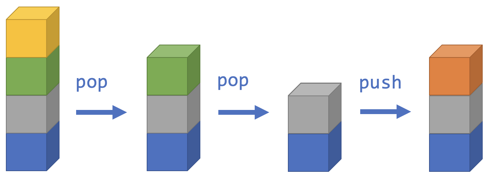

<!-- # [Link to video.]() -->

### Stacks

A **stack** is a collection of items that are "stacked" on top of each other. Items get added and removed from the top of the stack. Another way of saying *remove an item* is **pop** and another way of saying *add an item* is **push**.



This system is called *Last In, First Out*. The items that are added the latest are the ones that get removed the earlist.

Another way of saying *look at the top item* is **peek**. The idea is that if the items were enclosed in an opaque box, you could peek at the top item by removing the lid.

Java has a class called `Stack`. Here's [the official documentation](https://docs.oracle.com/javase/7/docs/api/java/util/Stack.html) for it. It's a subclass of `Collection` and a subclass of `List`. We can use all the static methods from `Collection` and `List` as well as the static methods that are specific to `Stack`. Here are some of the ones specific to `Stack`:

| static methods | description |
| -- | -- |
| `push()` | adds an item to the top of the stack *and* returns it |
| `pop()` | removes an item from the top of the stack *and* returns it |
| `peek()` | returns the item at the top of the stack |

Here's a demonstration:

```java
/**
 * @author MissStrong
 */

import java.util.Stack; // we need to import this for Stack()

public class Main {

  /**
   * Playing with stacks.
   *
   * @param args the command line arguments
   */
  public static void main(String[] args) {
		
    Stack<String> colours = new Stack(); 
    
    // Stack() doesn't take any arguments so we have to add the items one at a time
    colours.push("blue");
    colours.push("grey");
    colours.push("green");
    colours.push("yellow");
    
    System.out.println(colours); // prints [blue, grey, green, yellow]
    System.out.println(colours.size()); // prints 4
    
    System.out.println(colours.pop()); // prints yellow
    System.out.println(colours); // prints [blue, grey, green]
    
    System.out.println(colours.peek()); // prints green
    System.out.println(colours.pop()); // prints green
    System.out.println(colours); // prints [blue, grey]
    
    System.out.println(colours.peek()); // prints grey
    System.out.println(colours.push("orange")); // prints orange
    System.out.println(colours); // prints [blue, grey, orange]
    
    colours.clear();
    System.out.println(colours); // prints []
 
  }    
}
```

### `add()` and `remove()` vs. `push()` and `pop`

Although `add()` and `remove()` can be used for stacks, it's better practice to use `push()` and `pop()` since they remind the person reading the code that stacks are being used instead of other types of lists.

Furthermore, their return values are different. `add()` and `remove()` return a boolean value based on whether the item was successfully added or removed whereas `push()` and `pop()` return the item that was added or removed so you can keep using it if you need it.


### Example

An example of a practical application of a stack is your browser history. Every time you visit a new webpage, it gets added to the top of your browser history. Every time you hit "back", it removes the webpage you were just at from the stack, and brings you back to the most previously visited webpage. Of course, you can jump back more than one page at once, which a stack doesn't have to do, but the basic operations of web browsing follow a stack.
