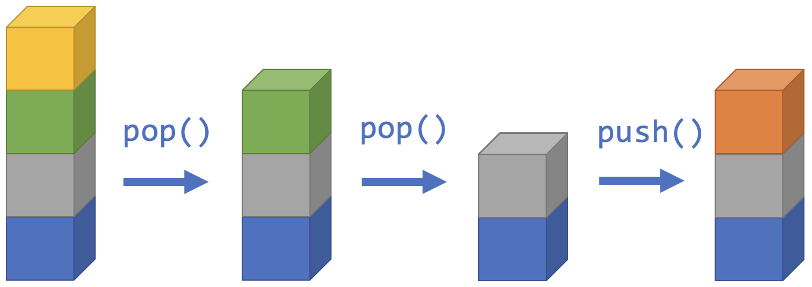

<!-- # [Link to video.]() -->

### Stacks

A **stack** is a collection of items that are "stacked" on top of each other. Items get added and removed from the top of the stack. Another way of saying *remove an item* is **pop** and another way of saying *add an item* is **push**.

This system is called *Last In, First Out*. The items that are added most recently are the ones that get removed first.

Another way of saying *look at the top item* is **peek**. The idea is that if the items were enclosed in an opaque box, you could peek at the top item by removing the lid.

Java has a class called `Stack`. Here's [the official documentation](https://docs.oracle.com/javase/7/docs/api/java/util/Stack.html) for it. It's a subclass of `Collection` and a subclass of `List`. We can use all the static methods from `Collection` and `List` as well as the static methods that are specific to `Stack`. Here are some of the ones specific to `Stack`:

| static methods | description |
| -- | -- |
| `push()` | adds an item to the top of the stack *and* returns it |
| `pop()` | removes an item from the top of the stack *and* returns it |
| `peek()` | returns the item at the top of the stack |

### Example

An example of a practical application of a stack is your browser history. Every time you visit a new webpage, it gets added to the top of your browser history. Every time you hit "back", it removes the webpage you were just at from the stack, and brings you back to the most previously visited webpage. Of course, you can jump back more than one page at once, which a stack doesn't have to do, but the basic operations of web browsing follow a stack.
