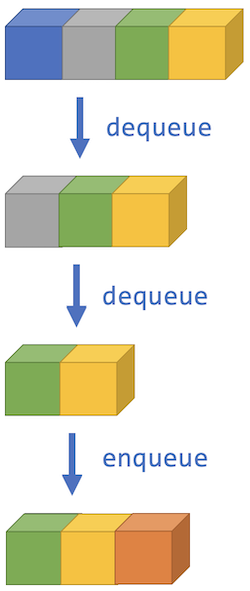

<!-- # [Link to video.]() -->

### Queues

A **queue** (pronounced like the letter "Q") is a collection of items that are lined up. Items get added to the back of the queue and removed from the front of the queue. Another way of saying *remove an item* is **dequeue** (pronounced D.Q.) and another way of saying *add an item* is **enqueue** (pronounced on-Q).



This system is called *First In, First Out*. The items that are added the earliest are the ones that get removed the earlist.

When we **peek** at a queue, we look at the front item. The idea is that if the items were enclosed in an opaque box with two openings, you could peek at the front item through the front opening.

Java has an interface called `Queue`. Here's [the official documentation](https://docs.oracle.com/javase/7/docs/api/java/util/Queue.html) for it. Here are some of the static methods from it:

| static methods | description |
| -- | -- |
| `add()` | adds an item to the back of the queue |
| `offer()` | same as `add()`, except it doesn't throw an error if it fails |
| `remove()` | removes an item from the front of the queue |
| `poll()` | same as `remove()`, except it doesn't throw an error if it fails |
| `peek()` | returns the item at the front of the queue |

The class we'll be using to implement queues is `LinkedList` (you can think of the items as being individially linked to the ones next to it). Here's a demonstration:

```java
/**
 * @author MissStrong
 */

import java.util.Queue; // we need to import this to use the Queue data type
import java.util.LinkedList; // we need to import this for LinkedList()
import java.util.List; // we need to import this for List.of()

public class Main {

  /**
   * Playing with queues.
   *
   * @param args the command line arguments
   */
  public static void main(String[] args) {
		
    Queue<String> colours = new LinkedList(List.of("blue", "grey", "green", "yellow")); 
    
    System.out.println(colours); // prints [blue, grey, green, yellow]
    System.out.println(colours.size()); // prints 4
    
    System.out.println(colours.poll()); // prints blue
    System.out.println(colours); // prints [grey, green, yellow]
    
    System.out.println(colours.peek()); // prints grey
    System.out.println(colours.poll()); // prints grey
    System.out.println(colours); // prints [grey, yellow]
    
    System.out.println(colours.remove()); // prints green
    colours.offer("orange"); 
    System.out.println(colours); // prints [yellow, orange]
    
    colours.clear();
    System.out.println(colours); // prints []
 
  }    
}
```

### Example

An example of a practical application of a queue is priorititizing requests from userw when maintaing software. Requests are typically done on a first-come first-serve basis, although more important requests (e.g. vulnerability issues) could "cut in line". 
