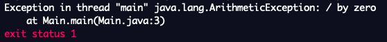

## Note – Exception Handling


Whenever we run a program that has errors, we may have noticed that Replit attempts to tells we what kind of error it is. 

For example, if we try to divide by zero, we get a message in the console saying that there was an **exception** called `java.lang.ArithmeticException`.



An exception is a problem that occurs while a program is running. When an exception occurs, the Java runtime "throws" it. When an exception is thrown and our program doesn't "catch" it (i.e. it doesn't handle it), the program terminates abruptly. There are more than 450 kinds of exceptions built into Java; we can view these all on the [Java API documentation](https://docs.oracle.com/javase/7/docs/api/java/lang/Exception.html).

In order to avoid a program from terminating abruptly, we should consider possible exceptions that could occur in our methods.

Here is an example of a method that handles a division by zero error.

```java
public static int divideThreeInts(int a, int b, int c) {
    try {
        return a/b/c;
    } catch(ArithmeticException exception) {
        if (b == 0) System.out.println("Error. B cannot be zero.");
        if (c == 0) System.out.println("Error. C cannot be zero.");
        System.exit(0);
        return 0;
    }
}
```

The content in the `try` block is run first. It tries to run the lines in the block; if an exception occurs, the exception is "thrown" and the rest of the block does not run. 

The content in the `catch` block runs only when the exception `ArithmeticException` has been thrown. It "catches" the exception.

The line `System.exit(0);` is used to indicate that the program has successfully run. If `System.exit(1);` is used instead, the program terminates abruptly. Since `return 0;` (0 is a dummy value here) is placed after it, it is actually never reached. If we exclude the `return` statement, we will get a warning that a `return` statement is missing and it won't let us run the program.

If there are more lines of code us want to run regardless of whether the catch block is run, we can use a `finally` block. 

### NullPointerException

The null pointer exception is one of the most notorious exceptions in Java. The inventor of the null reference, Sir Charles Antony Richard Hoare, once said,

> *"I call it my billion-dollar mistake. It was the invention of the null reference in 1965… This has led to innumerable errors, vulnerabilities, and system crashes, which have probably caused a billion dollars of pain and damage in the last forty years".*

The null pointer exception occurs when a program tries to use an object reference that has a null value. We'll learn more about this in a later lesson.
