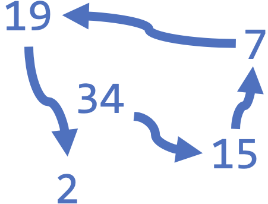

# [Link to Video](https://www.youtube.com/watch?v=yvEqyILtFTQ&list=PLVD25niNi0BlJk16vP7-qI-uiuEv0aaTK)

### Arrays

Recall that when we print an array without `Arrays.toString()`, it prints the **address** of the array.

```java
int[] array = {34, 15, 7, 19, 2};
System.out.println(array); // prints [I@2a139a55 (addresses will vary)
```

The address of an array is actually the address of the first item in the array. The rest of the items occupy the addresses next to it. The addresses increase by 8 bits (1 byte).

When you access an array item by its index, its address is retrieved using the calculation `8*index + &firstItem`, where `&` means "address of". If `&array[0]` is `[I@2a139a55`, then `&array[1]` is `[I@2a139a63`, and the `&array[2]` is `[I@2a139a71`, etc. 

 


 
Since items in an array are stored next to each other, inserting or deleting items in the middle of an array causes the remaining items to shift over so that they are located at the correct address. The time complexity for these operations is *O(n)*, where *n* is the length of the list. 

### Linked Lists

Linked lists are stored differently from arrays. Linked lists contain **nodes**, each of which has a value and a pointer to the next node. They can be represented like this:



Inserting or deleting items from the middle of a linked list has a time complexity of *O(1)* (constant time) since it's just a matter of removing the node and adjusting the pointer in previous node.

Linked lists are representations for queues, since popping/dequeueing and pushing/enqueueing are both *O(1)*. However, linked lists should not be used whenever you intend to sort the items.
