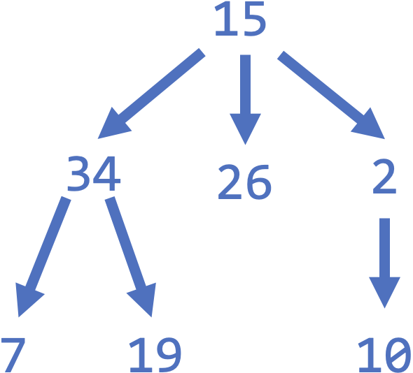

# [Link to Video](https://www.youtube.com/watch?v=JrItuYgRpX4&list=PLVD25niNi0BlJk16vP7-qI-uiuEv0aaTK)

### Trees

A tree is a data structure involving nodes and pointers. Each node can connect to several other nodes, as long as it does not create a cycle.



In the example above, the **root** is 15, and its **children** are 34, 26, and 2. 34's children are 7 and 19, and 2's child is 10. The **leaves** are 7, 19, 26, and 10, since they do not have children.

### Depth-First Search (DFS)

When searching for a node in a tree, one approach is going down each path from the root to each leaf. This is called **depth-first search**. In the previous example, a DFS would check the nodes in the following order: 15, 34, 7, 9, 26, 2, 10. This can be accomplished using recursion.

### Breadth-First Search (BFS)

Another approach for searching for a node in a tree is to check each level one at a time. This is called **breadth-first search**. In the previous example, a BFS would check the nodes in the following order: 15, 34, 26, 2, 7, 19, 20.
7, 9, 26, 2, 10. This can be accomplished using a queueing system.

### Adjacency List

One of the ways of storing a tree is an **adjacency list**. This shows which node connects to other nodes. Here is an adjacency list for the example.

```
{
15: [34, 26, 2],
34: [7, 19],
26: [],
2: [10],
7: [],
19: [],
10: []
}
```

### Binary Search Trees

TODO
