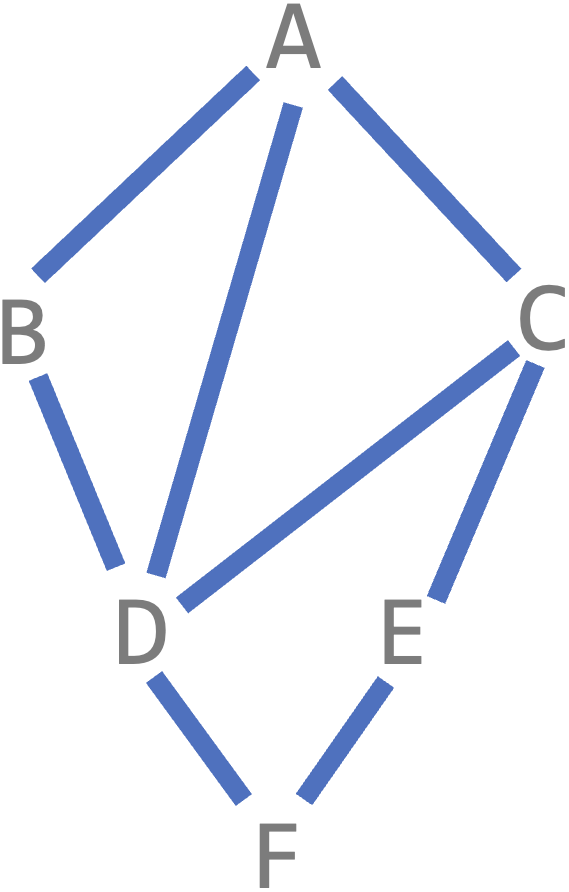
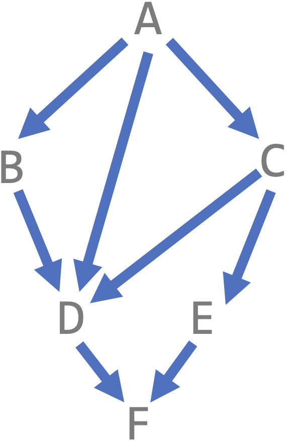
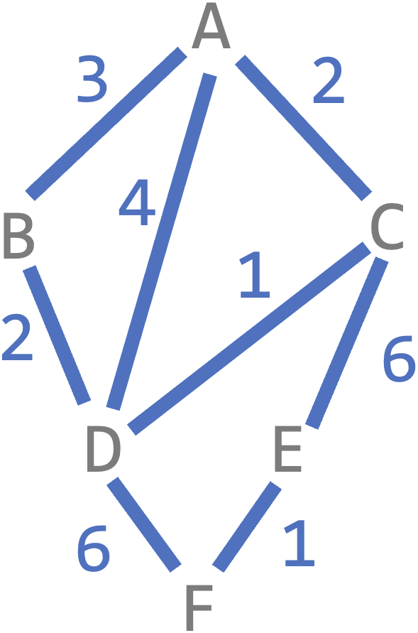

# [Link to Video](https://www.youtube.com/watch?v=EOS0SD_xFrU&list=PLVD25niNi0BlJk16vP7-qI-uiuEv0aaTK)

### Graphs

A graph is a data structured involving **vertices** (nodes) and **edges** (pointers). An edge can connect any two nodes. 



### Adjacency Lists

A graph can be stored using an **adjacency list**. Here is an adjacency list (in pseudocode) for the previous example.

```
{
A: [B, C, D],
B: [A, D],
C: [A, D, E],
D: [A, B, C, F],
E: [C, F],
G: [D, E],
}
```

### Directed Graphs

**Directed** graphs show the direction of the edges. If the direction is not specified, it goes in both directions.




### Weighted Graphs

**Weighted** graphs show the **weight** or **cost** of each edge. If a weight is not specified, the weight is 1 by default.




### Searching Graphs

Both depth-first search (DFS) and breadth-first search (BFS) can be applied to **connected** graphs (graphs where every vertex is reachable from all other vertices).
