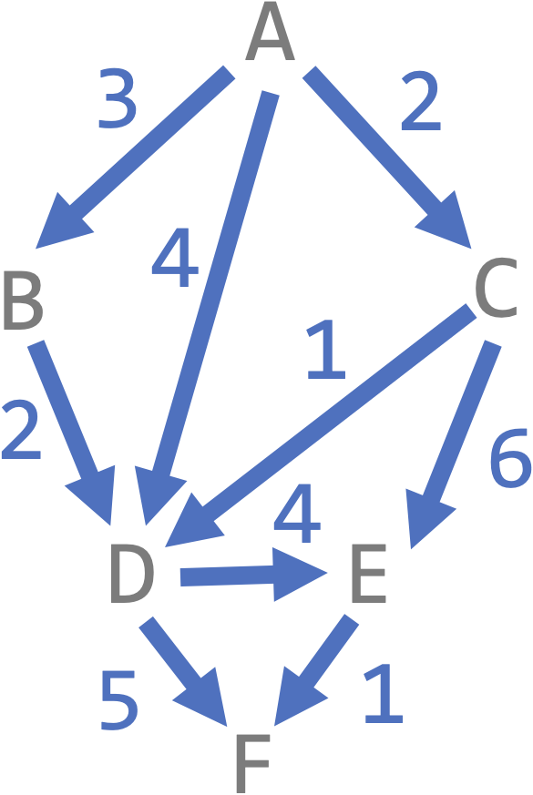
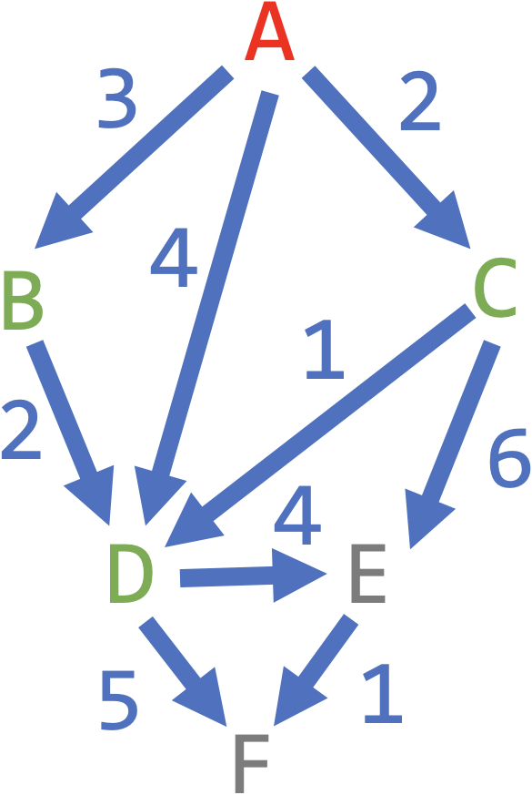
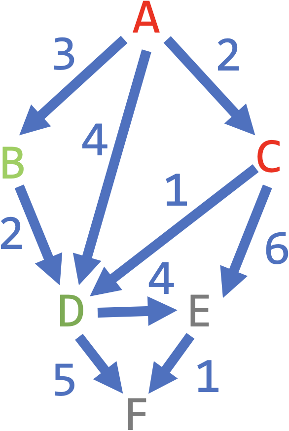
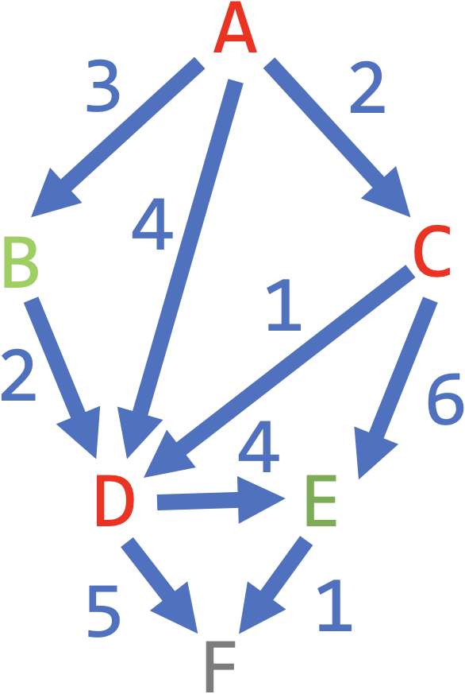
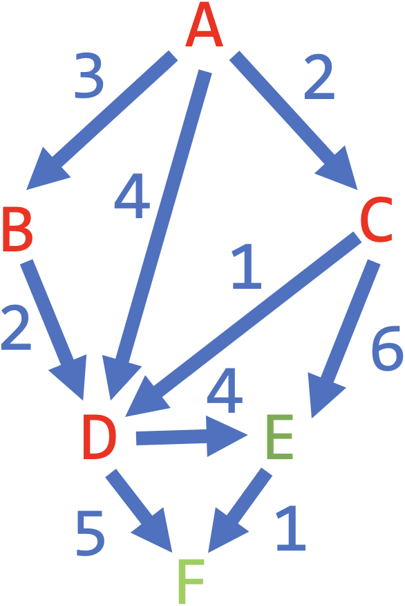
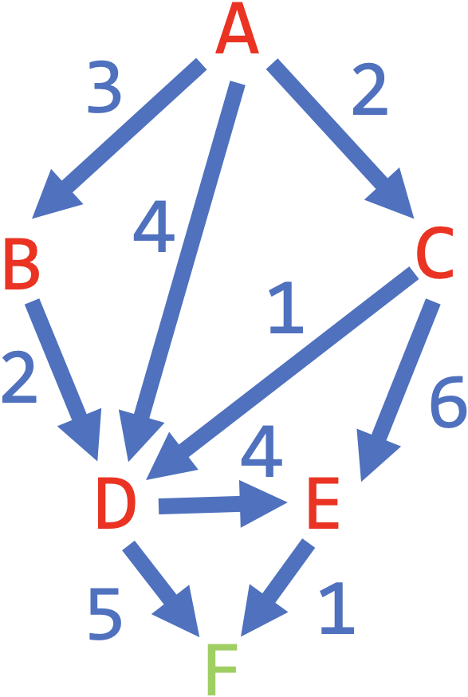
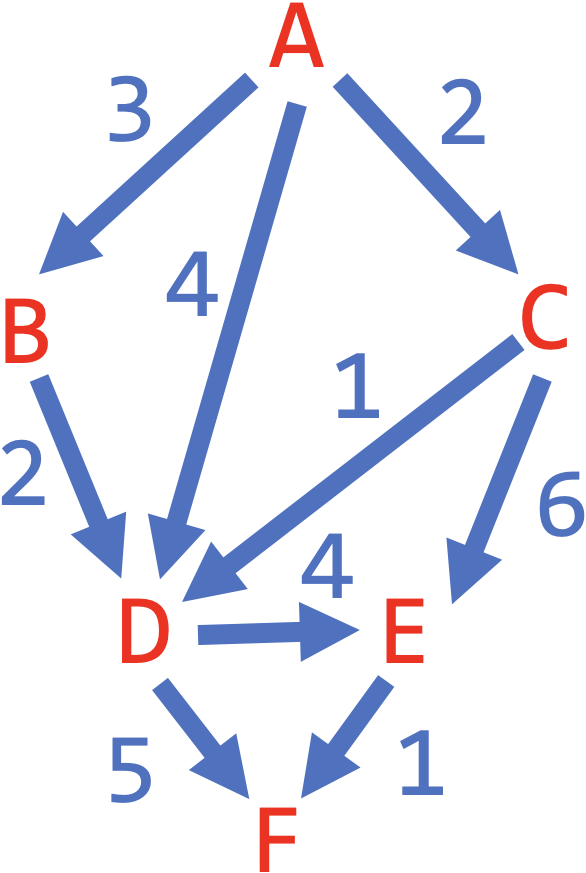

# [Link to Video](https://www.youtube.com/watch?v=vDFTpJBGxBw&list=PLVD25niNi0BlJk16vP7-qI-uiuEv0aaTK)

### Greedy Algorithms

A **greedy algorithm** is an algorithm where you apply the best-case scenario at each possible step. These are very common in graph theory.

### Shortest Paths

A **shortest path** from vertex A to vertex B is the cheapest collection of edges that connect A to B.

### Djikstra's Algorithm

**Djikstra's algorithm** is a greedy algorithm that finds the shortest paths from a specific vertex to all other vertices. At each step, you visit one new node and calculate the shortest path you've seen so far from the starting point to all visited vertices. Here is an example.



Choose a vertex to start on (A). Look at each of its neighbours and write down the cost for each path from the starting point.

``` 
Visited: A
A to A: 0
A to B: 3 (AB)
A to C: 2 (AC)
A to D: 4 (AD)
A to E: infinity
A to F: infinity
```



Visit the neighbour that is cheapest to get to, and look at each of its neighbours and update the costs.

```
Visited: A, C
A to A: 0 
A to B: 3 (AB)
A to C: 2 (AC)
A to D: 3 (ACD)
A to E: 8 (ACE)
A to F: infinity
```



Repeart the previous step until all vertices have been visited.

```
Visited: A, C, D
A to A: 0 
A to B: 3 (AB)
A to C: 2 (AC)
A to D: 3 (ACD)
A to E: 7 (ACDE)
A to F: 8 (ACDEF)
```



```
Visited: A, C, D, B
A to A: 0 
A to B: 3 (AB)
A to C: 2 (AC)
A to D: 3 (ACD)
A to E: 7 (ACDE)
A to F: 8 (ACDEF)
```



```
Visited: A, C, D, B, E
A to A: 0 
A to B: 3 (AB)
A to C: 2 (AC)
A to D: 3 (ACD)
A to E: 7 (ACDE)
A to F: 8 (ACDEF)
```



```
Visited: A, C, D, B, E, F
A to A: 0 
A to B: 3 (AB)
A to C: 2 (AC)
A to D: 3 (ACD)
A to E: 7 (ACDE)
A to F: 8 (ACDEF)
```


