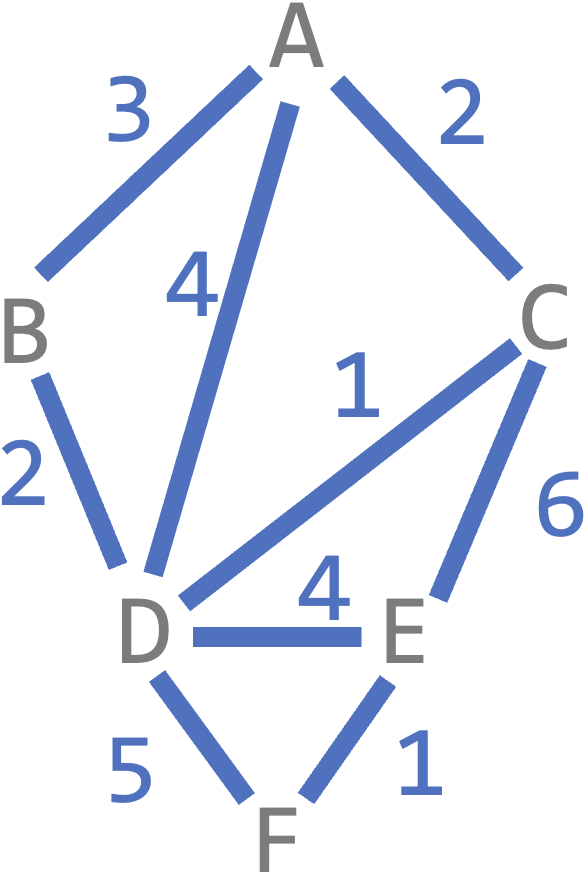
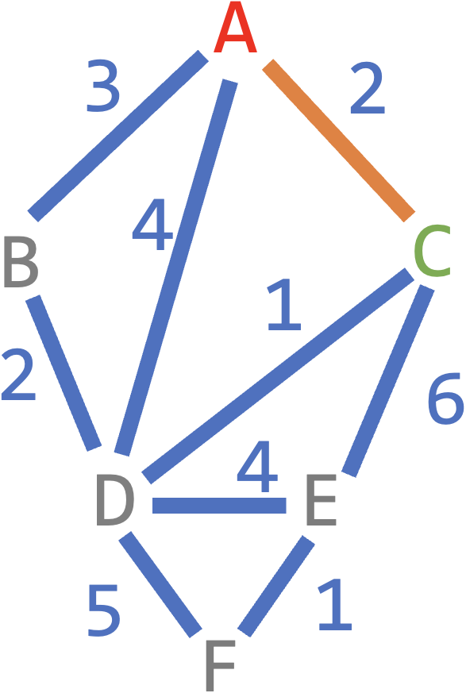
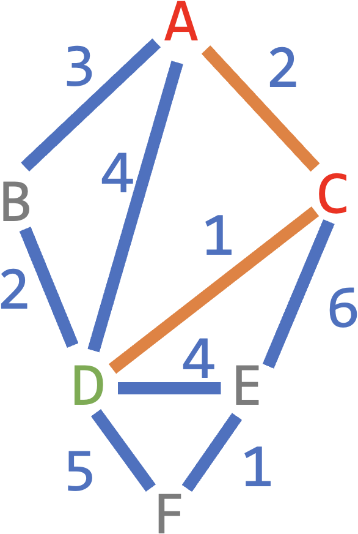
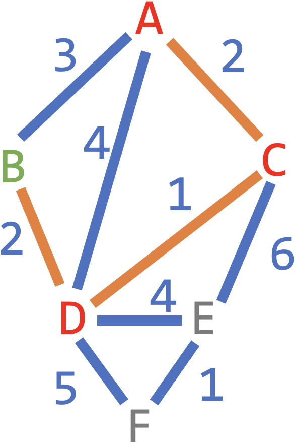
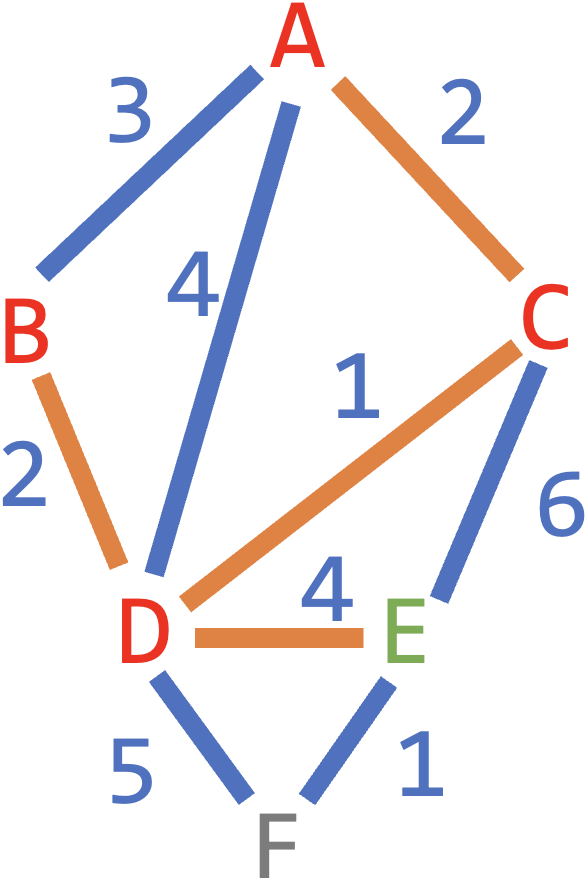
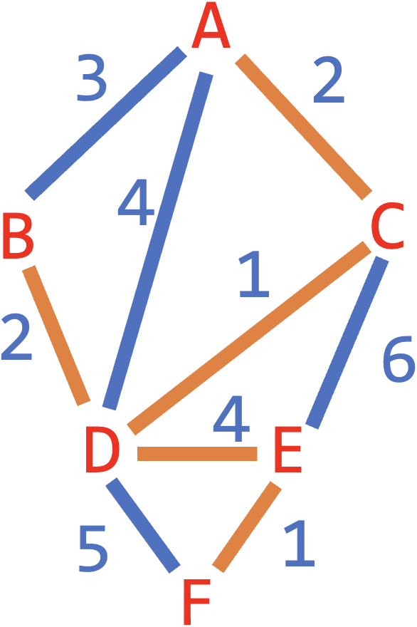

# [Link to Video](https://www.youtube.com/watch?v=488tiRq5tes&list=PLVD25niNi0BlJk16vP7-qI-uiuEv0aaTK)

### Minimum Spanning Tree

A **spanning tree** is a tree inside a graph that connects every node. The **minimum spanning tree** of a graph is the cheapest spanning tree.

### Prim's Algorithm

**Prim's algorithm** is a greedy algorithm that finds the minimum spanning tree by starting at a node and connecting other nodes until you have a spanning tree. At each step, you visit the node that is cheapest to connect that you have not already visited. Here is an example.



Choose a vertex to start on (A). Look at each of its edges and choose the cheapest one.

```
Visited: A
Next node: C
Edges: AC
```



Find the next cheapest edge connected to the vertices you have visited.

```
Visited: A, C
Next node: D
Edges: AC, CD
```



Repeart the previous step until all vertices have been visited.

```
Visited: A, C, D
Next node: B
Edges: AC, CD, DB
```



```
Visited: A, C, D, B
Next node: E
Edges: AC, CD, DB, DE
```



```
Visited: A, C, D, B, E
Next node: F
Edges: AC, CD, DB, DE, EF
```




Here is the minimum spanning tree:


