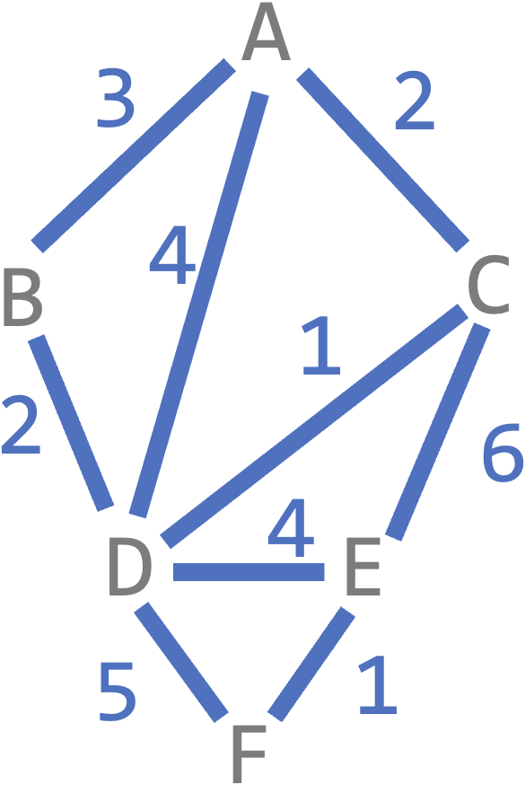
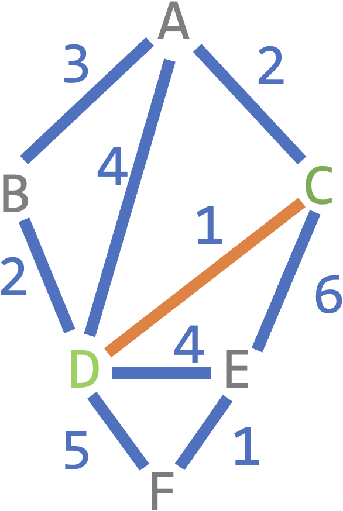
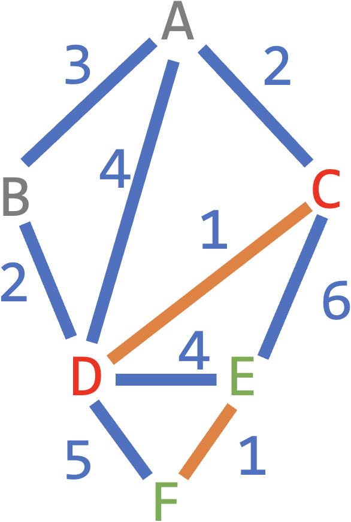
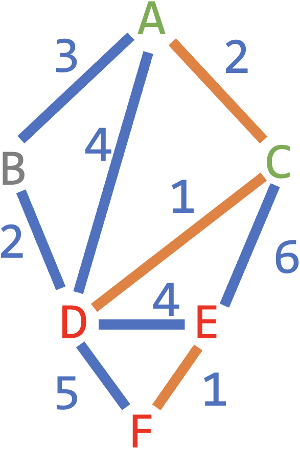
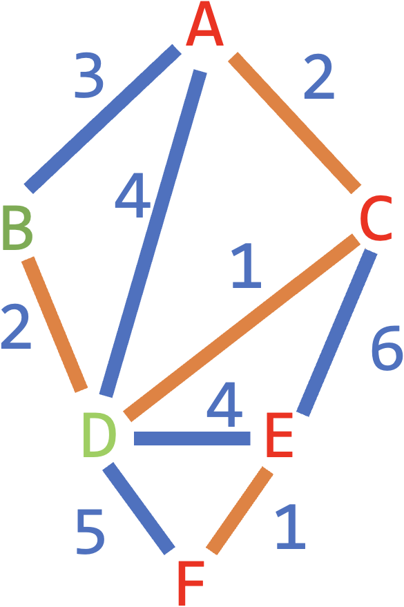
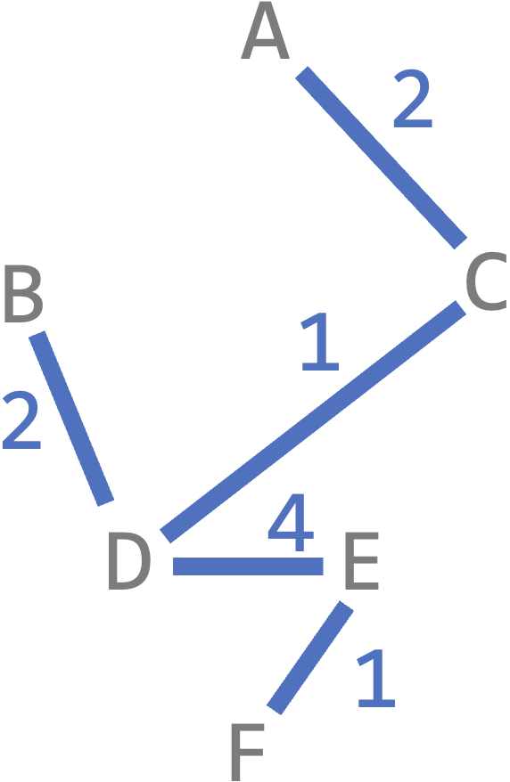

# [Link to Video](https://www.youtube.com/watch?v=sEVb0ThUu0Q&list=PLVD25niNi0BlJk16vP7-qI-uiuEv0aaTK)

### Kruskal's Algorithm

**Kruskal's algorithm** is a greedy algorithm that finds the minimum spanning tree by collecting edges until you have a minimum spanning tree. At each step, you collect the cheapest edge that does not create a cycle. Here is an example.




Start with the cheapest edge (CD).

```
Edges: CD
```



Find the next cheapest edge that doesn't cause a cycle.

```
Edges: CD, EF
```



Repeart the previous step until all vertices are connected.

```
Edges: CD, EF, AC
```



```
Edges: CD, EF, AC, BD
```



AB is the cheapest, but it would cause a cycle (ACDBA) so don't collect it.

```
Edges: CD, EF, AC, BD, DE
```


Here is the minimum spanning tree, which has a total cost of 10:



